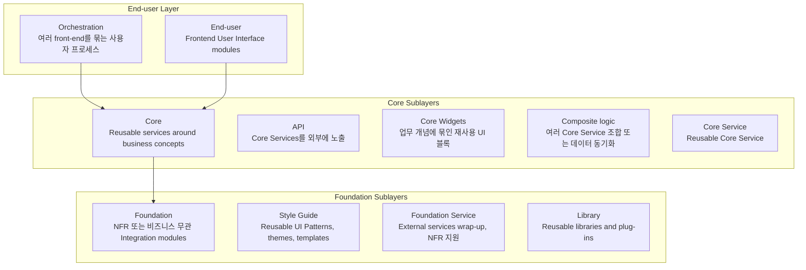
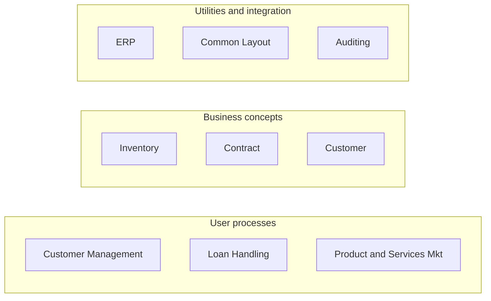
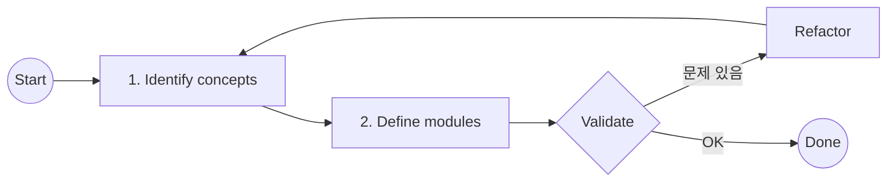

# OutSystems Architecture Specialist (O11)
## Architecture Canvas 그림 3개 완전 연결 복습본

> 이 문서의 핵심: 그림 1 → 그림 2 → 그림 3 순서로 연결해서 공부한다.

---

## 0. 세 그림을 한 번에 연결해서 보기

1. **그림 2**처럼 업무 자료에서 User process, Business concept, Utility/Integration concept를 식별한다.
2. **그림 1**의 Architecture Canvas Sublayer 기준으로 각각을 어느 Layer에 둘지 정한다.
3. **그림 3**처럼 Define modules 후 Validate/Refactor를 반복한다.

### 시험 암기 문장
- Identify concepts first, then define modules and place them in the correct layer.
- Architecture design is an iterative process.
- Dependencies should flow from End-user to Core to Foundation.

---

## 1. 그림 1 - The Architecture Canvas (sublayers)

### 1-1. 큰 색상 구분

| 색상/영역 | 큰 의미 | 시험 판단 기준 |
|---|---|---|
| 파란색 영역 | User process / Frontend 쪽 | 화면, 사용자 여정, 여러 front-end를 묶는 흐름 |
| 주황색 영역 | Core business 쪽 | 업무 개념, 업무 엔터티, 업무 규칙, 업무 서비스 |
| 초록색 영역 | Foundation / 공통 기반 쪽 | 비기능 요구사항, 외부 연계, 공통 UI, 라이브러리, 플러그인 |

### 1-2. Sublayer 별 상세 설명

| Sublayer | 그림 속 설명 | 시험식 해석 |
|---|---|---|
| Orchestration | 여러 frontends를 mashup하여 unified UX 또는 cross-application workflow 제공 | 여러 앱/화면을 묶는 상위 사용자 프로세스. 단순 Core Service가 아니다. |
| End-user | Frontend User Interface modules | 사용자가 직접 보는 화면, UI Flow, User Journey. 재사용 서비스 제공자가 아니다. |
| Core | Business concepts around reusable services | Customer, Contract, Inventory 같은 업무 개념 중심 영역. 업무 엔터티와 업무 규칙을 담는다. |
| API | Core Services를 외부에 노출하는 API 제공 | Core Service 자체가 아니라, Core를 외부/타시스템에 노출하는 통로. |
| Core Widgets | Core Widgets | 업무 개념에 묶인 재사용 UI 블록. 예: Customer selector, Product picker. |
| Composite logic | Business Logic Composition 또는 Data Synchronize logic | 여러 Core Service를 조합하거나 데이터 동기화 로직을 담당. |
| Core Service | Reusable Core Service | 업무 개념을 재사용 서비스로 제공. 예: Customer_CS, Contract_CS, Inventory_CS. |
| Foundation | NFR 또는 Integration modules, any business context에서 재사용 | 특정 업무에 묶이지 않는 공통 기반. NFR은 Non-Functional Requirement. |
| Style Guide | Reusable UI Patterns, themes, theme templates | 공통 Layout, Theme, UI Pattern. Customer 업무 규칙이 들어가면 안 됨. |
| Foundation Service | External services wrap-up, NFR 지원 서비스 예: Audit trail | ERP/API/외부 서비스 연계, Auditing, Logging 같은 공통 서비스. |
| Library | Reusable libraries and plug-ins | 공통 라이브러리, 플러그인. 업무 개념이 아니라 기술 재사용 단위. |

### ⚠️ 그림 1 시험 함정

- **Customer** 라는 업무 개념은 Foundation이 아니라 **Core** 후보이다.
- **Common Layout**은 화면에 보이지만 End-user가 아니라 **Style Guide** 후보이다.
- **Auditing**은 업무 데이터처럼 보여도 비기능 요구사항이므로 **Foundation Service** 후보이다.
- **ERP**는 외부 시스템이므로 End-user가 직접 호출하지 않고 **Integration/Foundation Service**가 감싼다.

---

## 2. 그림 2 - Identify Concepts 예시

> 이 그림은 모듈을 만든 결과가 아니라, "업무 자료에서 어떤 concept 후보를 찾아냈는지"를 분류한 그림입니다.

### 2-1. 그림 속 박스별 Layer 후보

| 그림 속 그룹 | 박스 | Layer/Sublayer 후보 | 판단 이유 |
|---|---|---|---|
| User processes | Customer Management | End-user | 고객 업무를 수행하는 사용자 프로세스/화면 흐름 |
| User processes | Loan Handling | End-user 또는 Orchestration | 여러 front-end/업무 흐름을 묶으면 Orchestration 후보 |
| User processes | Product and Services Mkt | End-user | 마케팅 업무 화면/사용자 여정 성격 |
| Business concepts | Inventory | Core / Core Service | 재고는 업무 개념. 엔터티, 규칙, CRUD가 Core에 속함 |
| Business concepts | Contract | Core / Core Service | 계약은 업무 개념. 계약 데이터/규칙은 Core |
| Business concepts | Customer | Core / Core Service | 고객은 대표적인 업무 개념. 데이터/규칙이면 Core |
| Utilities and integration | ERP | Foundation Service / Integration Service | 외부 시스템 연계. 직접 UI가 호출하지 않고 wrapper로 추상화 |
| Utilities and integration | Common Layout | Style Guide | 공통 Layout/Theme/UI Pattern이므로 재사용 UI 기반 |
| Utilities and integration | Auditing | Foundation Service | 감사 추적은 비기능 요구사항. 특정 업무 Core가 아니라 공통 기반 |

### 2-2. 바로 외울 공식

> **User processes** = End-user 후보  
> **Business concepts** = Core 후보  
> **Utilities and integration** = Foundation 후보

- Management / Handling / Portal / Backoffice / Mkt = 사용자 프로세스 또는 화면 흐름 → **End-user** 후보
- Customer / Contract / Inventory / Product / Order = 업무 개념 → **Core** 후보
- ERP / Auditing / Logging / Common Layout / Theme / Plugin = 공통 기반 또는 외부 연계 → **Foundation** 후보

---

## 3. 그림 3 - Architecture Iteration

### 3-1. 단계별 해석

| 단계 | 영어 | 한글 의미 | 시험 포인트 |
|---|---|---|---|
| 1 | Identify concepts | 업무 개념을 식별한다 | 화면부터 만들지 말고 concept를 먼저 찾는다 |
| 2 | Define modules | 개념을 모듈로 정의한다 | Layer/Sublayer에 맞게 모듈 책임을 나눈다 |
| 반복 | Architecture Iteration | 아키텍처 반복 | 검증 후 문제 있으면 Refactor하고 다시 배치한다 |

### 3-2. Dependency 기본 방향

- **End-user → Core → Foundation** 방향이 기본이다.
- Core → End-user는 화면 의존성이므로 위험하다.
- Foundation → Core는 공통 기반이 업무 개념을 알아버리므로 위험하다.
- End-user → End-user는 lifecycle 독립성을 깨뜨릴 수 있다.

---

## 4. 시험 함정 종합 정리

| 헷갈리는 상황 | 잘못된 판단 | 정답 방향 |
|---|---|---|
| Customer Management | Customer가 있으니 Core | Management는 사용자 프로세스이므로 End-user 후보 |
| Customer | 고객 화면이라 End-user | 고객 개념/데이터/규칙이면 Core 후보 |
| Common Layout | 화면에 보이니 End-user | 공통 Layout/Theme라 Style Guide 후보 |
| Auditing | 업무 로그니까 Core | 비기능 요구사항이라 Foundation Service 후보 |
| ERP | Customer 데이터가 있으니 Core | 외부 시스템 연계라 Integration/Foundation Service 후보 |
| Product and Services Mkt | Product가 있으니 Core | Mkt는 사용자 프로세스/업무 화면 흐름이면 End-user 후보 |
| Composite Logic | 무조건 Foundation | 여러 Core Service를 조합하는 재사용 업무 로직이면 Core sublayer 후보 |
| API | Foundation API | Core Services를 노출하는 API면 Core sublayer의 API 후보 |

---

## 5. 실전 문제

**Q1.** Which group is the best candidate for End-user modules?
- A. Business concepts
- **B. User processes** ✅
- C. Utilities and integration
- D. Libraries only

**Q2.** Where should Customer entities and Customer business rules usually be placed?
- A. End-user
- **B. Core** ✅
- C. Style Guide
- D. Library

**Q3.** Which sublayer is the best fit for Common Layout?
- A. Core Service
- B. API
- **C. Style Guide** ✅
- D. Composite Logic

**Q4.** Which sublayer is the best fit for Auditing?
- A. End-user
- **B. Foundation Service** ✅
- C. Core Widgets
- D. API

**Q5.** What does Architecture Iteration imply?
- A. Architecture is defined once and never changed
- **B. Concepts and modules are reviewed, validated, and refined repeatedly** ✅
- C. All modules must be in the same layer
- D. Dependencies are not relevant

**Q6.** A module provides reusable services around Contract business rules. Where should it be placed?
- **A. Core Service** ✅
- B. Style Guide
- C. Library
- D. End-user

**Q7.** A module wraps an ERP service and normalizes its outputs. Where should it be placed?
- A. End-user
- **B. Foundation Service / Integration Service** ✅
- C. Core Widgets
- D. Orchestration

**Q8.** Which statement is the safest architecture principle?
- A. Screens can directly call external ERP APIs
- B. Foundation modules should depend on Customer Core modules
- **C. Dependencies should generally flow from End-user to Core to Foundation** ✅
- D. End-user modules should provide reusable business services

> **채점용 정답: 1B 2B 3C 4B 5B 6A 7B 8C**
