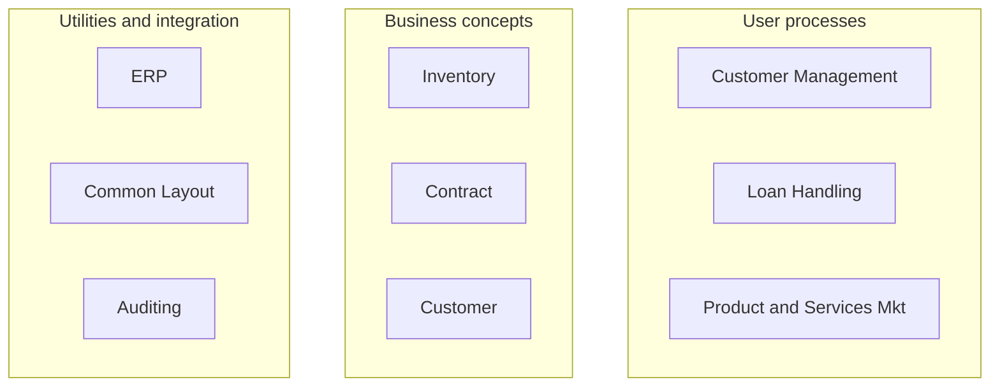

# 3단원. Translating Business Concepts into Application Modules
## 부제: Concept Granularity와 Module Definition 기준

> 🌐 **스타일 버전 (색상/다이어그램 완전 재현):**
> [htmlpreview로 보기](https://htmlpreview.github.io/?https://github.com/kckworld/outsystems_study/blob/main/Architecture%20Specialist%20(O11)/02_Chapter3_Concept_Granularity.html)

---

> **이 단원의 위치**
> 이 단원은 이전의 Architecture Canvas 기본 구조 다음에 이어지는 별도 단원입니다. 핵심은 "그림에서 찾은 concept를 몇 개의 module로 나눌 것인가?"입니다.

---

## 1. 그림 먼저 보기: Concept 후보 분류

*그림 1. User processes / Business concepts / Utilities and integration*

이 그림은 모듈 설계 전 단계에서 업무 자료를 보고 concept 후보를 먼저 분류하는 예시입니다. 아직 실제 모듈명이 확정된 상태가 아닙니다.

| 그림 영역 | 그림 속 예시 | Architecture Canvas 후보 | 판단 기준 |
|---|---|---|---|
| User processes | Customer Management, Loan Handling, Product and Services Mkt | End-user / Orchestration | 사용자 업무 흐름, 화면, 프로세스 중심 |
| Business concepts | Inventory, Contract, Customer | Core / Core Service | 업무 개념, 업무 엔터티, 업무 규칙 중심 |
| Utilities and integration | ERP, Common Layout, Auditing | Foundation / Style Guide / Foundation Service / Library | 공통 기술, 외부 연계, 비기능 요구사항 중심 |

> **시험 핵심 공식**
> User processes = End-user 후보 / Business concepts = Core 후보 / Utilities and integration = Foundation 후보

---

## 2. 영어 원문과 한글 해석

| English | Korean |
|---|---|
| The number of modules that need to be defined to implement these concepts depends on the concept granularity. | 이 concept들을 구현하기 위해 정의해야 하는 모듈 수는 concept의 granularity, 즉 세분화 수준에 따라 달라진다. |
| To define an architecture, concepts don't need to be captured at very low level. | 아키텍처를 정의할 때 concept를 지나치게 낮은 수준까지 세세하게 잡을 필요는 없다. |
| The correct granularity is influenced by complexity, independent life cycles, and service isolation. | 올바른 granularity는 복잡도, 독립적인 생명주기, 서비스 격리 기준의 영향을 받는다. |

---

## 3. Granularity란 무엇인가?

Granularity는 concept를 얼마나 크게 또는 작게 나누어 볼 것인지를 뜻합니다. 즉, Customer Management를 하나의 큰 덩어리로 볼지, 신규 고객 등록 / 고객 트렌드 분석 / 고객 서비스 추가 같은 여러 하위 concept로 나눌지 결정하는 기준입니다.

- 너무 크게 잡으면: 한 모듈이 너무 복잡해지고 변경 영향이 커진다.
- 너무 작게 잡으면: 모듈 수가 과도하게 늘고 dependency 관리가 어려워진다.
- 좋은 granularity는 complexity, independent life cycles, service isolation을 기준으로 결정한다.

---

## 4. 모듈 분리 기준 1: Complexity

Complexity는 concept가 너무 커서 하나의 모듈로 구현하기 어려운 경우를 말합니다.

> *영어 핵심: A concept may be too vast to be implemented in a single module.*

예를 들어 Customer Management는 하나의 사용자 프로세스처럼 보이지만, 실제로는 여러 하위 프로세스를 포함할 수 있습니다.

- Provisioning a new customer: 신규 고객 등록
- Analyzing customer trends: 고객 트렌드 분석
- Adding a service to a customer: 고객에게 서비스 추가

> **정리**
> 하나의 concept가 너무 크면 여러 module로 나누어 각 module의 복잡도를 관리 가능한 수준으로 유지한다.

---

## 5. 모듈 분리 기준 2: Independent Life Cycles

Independent life cycles는 기능들이 서로 다른 속도, 다른 팀, 다른 sponsor에 의해 변경되거나 배포되어야 하는 경우를 말합니다.

> *영어 핵심: Splitting a module in smaller concepts is required if you need to manage functionality independently.*

- 서로 다른 개발자가 병렬로 개발해야 하는 경우
- 기능별 변경 주기가 다른 경우
- 업무 sponsor가 서로 달라 evolution pace가 다른 경우
- 한 기능 변경이 다른 기능 배포에 영향을 주면 안 되는 경우

> **시험 포인트**
> 복잡하지 않아도 독립적으로 변경/배포해야 하면 모듈을 나눈다.

---

## 6. 모듈 분리 기준 3: Service Isolation

Service isolation은 integration pattern이나 service abstraction 때문에 하나의 business concept를 여러 기술 구성요소로 나누는 것입니다.

> *영어 핵심: Integration patterns may require splitting a concept into several technical components.*

예를 들어 Customer concept는 다음처럼 나뉠 수 있습니다.

| 모듈 예시 | 역할 | Layer / Sublayer 후보 |
|---|---|---|
| Customer_Backoffice | 고객 관리 화면, 사용자 프로세스 | End-user |
| Customer_CS | Customer 엔터티, 업무 규칙, 재사용 업무 Action | Core Service |
| Customer_IS | ERP/CRM 외부 연계 감싸기, 응답 정규화 | Foundation Service / Integration Service |
| Customer_API | Customer Core Service를 외부 소비자에게 노출 | API |
| Customer_Selector | Customer 업무 개념에 묶인 재사용 위젯 | Core Widgets |

---

## 7. 그림과 본문을 연결한 전체 흐름

1. 그림에서 User processes, Business concepts, Utilities and integration을 식별한다.
2. 각 concept를 Architecture Canvas의 Layer/Sublayer 후보로 배치한다.
3. Concept 하나를 반드시 module 하나로 만들지 않는다.
4. Complexity, Independent life cycles, Service isolation 기준으로 module granularity를 조정한다.
5. 정의한 모듈 구조가 Architecture Canvas 권장사항에 맞는지 validation한다.

---

## 8. 시험 함정 포인트

| 함정 문장 | 왜 틀리거나 위험한가? | 정답 방향 |
|---|---|---|
| Concept 하나는 항상 module 하나다. | Granularity에 따라 여러 module로 나뉠 수 있다. | Concept granularity 기준으로 결정 |
| Customer Management는 Customer가 있으니 Core다. | Management는 사용자 프로세스/화면 흐름이다. | End-user 후보 |
| Customer concept는 고객 화면이니 End-user다. | Customer 엔터티/규칙/재사용 Action이면 business concept다. | Core 후보 |
| 복잡하지 않으면 나누면 안 된다. | Independent life cycle이 필요하면 나눈다. | 독립 변경/배포 필요 시 분리 |
| ERP는 업무 데이터를 가지므로 Core다. | ERP는 외부 시스템 연계 대상이다. | Foundation Service / Integration Service |
| Common Layout은 화면에 보이므로 End-user다. | 공통 layout/theme는 재사용 UI 기반이다. | Style Guide |

---

## 9. 원장님 암기 문장

- Concept granularity determines how many modules are needed.
- Split concepts when complexity is high, life cycles are independent, or service isolation is required.
- User processes map to End-user, business concepts map to Core, utilities and integration map to Foundation.
- Do not capture concepts at an unnecessarily low level when defining the architecture.

---

## 10. 실전 문제

**Q1.** The number of modules needed to implement concepts depends mainly on:
> Q1. 개념 구현에 필요한 모듈 수는 주로 무엇에 달려 있는가?
- A. The number of screens only / B. Concept granularity / C. The number of users / D. The database size

정답 보기

✅ **정답: B** — Concept granularity가 모듈 수 결정에 영향을 준다.

**Q2.** A user process is too large and includes customer provisioning, trend analysis, and adding services. What should you do?
> Q2. 사용자 프로세스가 너무 커서 고객 등록, 트렌드 분석, 서비스 추가를 포함한다. 어떻게 해야 하는가?
- A. Keep it in one large module
- B. Split it into several modules to manage complexity
- C. Move everything to Foundation
- D. Remove the Core layer

정답 보기

✅ **정답: B** — Complexity가 높으면 여러 module로 분리한다.

**Q3.** Even if a module is not complex, why might you still split it?
> Q3. 모듈이 복잡하지 않아도 여전히 분리할 수 있는 이유는?
- A. To manage independent life cycles / B. To avoid using Service Studio / C. To remove all dependencies / D. To create more screens

정답 보기

✅ **정답: A** — 독립 변경/배포가 필요하면 분리한다.

**Q4.** Which criterion is related to integration patterns requiring several technical components?
> Q4. 여러 기술 구성요소를 필요로 하는 integration pattern과 관련된 기준은?
- A. UI styling / B. Service isolation / C. Screen navigation / D. Database indexing

정답 보기

✅ **정답: B** — Integration pattern 때문에 기술 구성요소 분리가 필요한 것이 Service isolation이다.

**Q5.** ERP in the picture is best classified as:
> Q5. 그림 속 ERP는 어떻게 분류하는 것이 가장 적절한가?
- A. End-user process / B. Core business concept / C. Utility and integration / D. Core Widget

정답 보기

✅ **정답: C** — ERP는 외부 연계 대상이므로 Utilities and integration이다.

---

> **한 줄 결론**
> 이 단원은 concept를 찾은 뒤 무조건 하나의 module로 만드는 것이 아니라, Complexity / Independent life cycles / Service isolation 기준으로 적절한 granularity의 모듈로 나누는 법을 설명한다.
