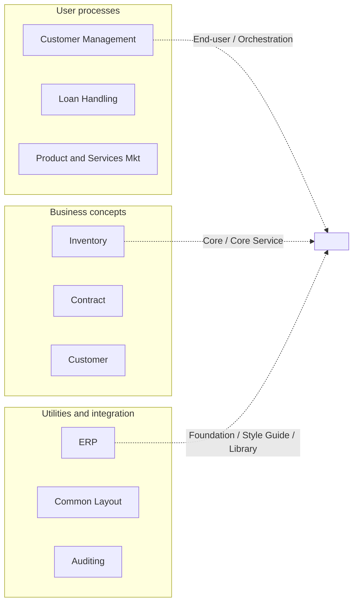
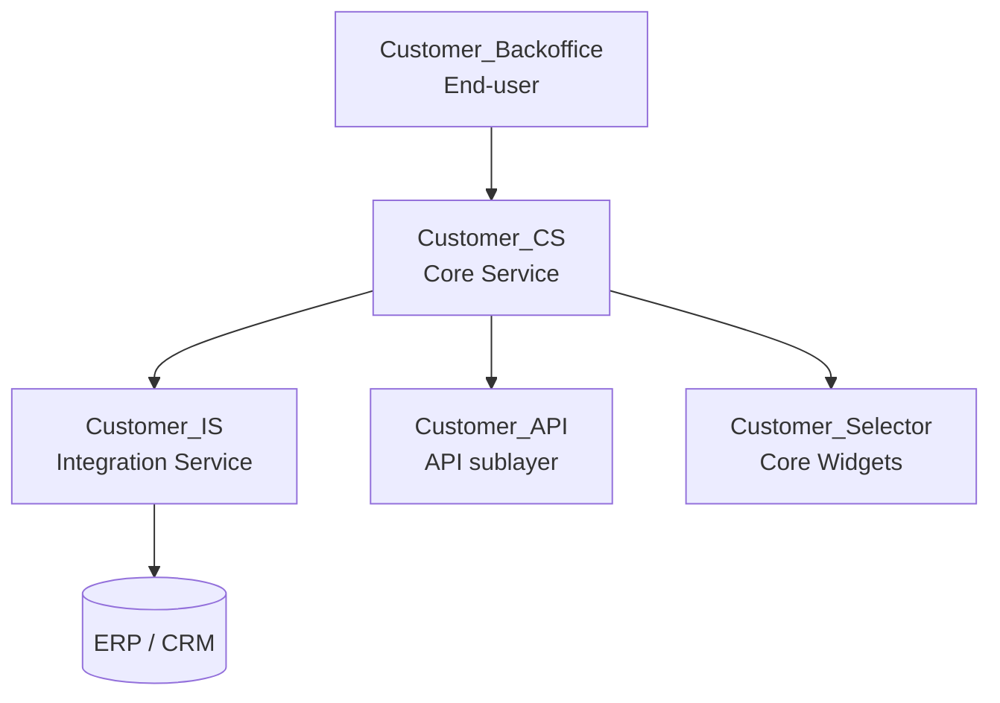
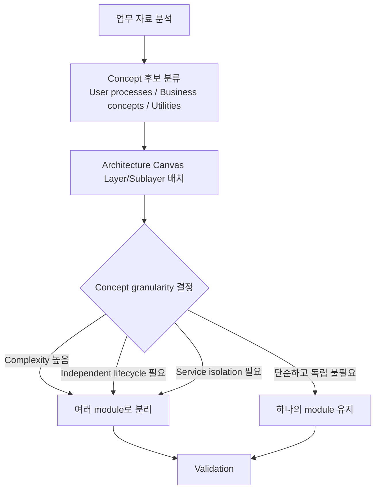

# OutSystems Architecture Specialist (O11)
## 3단원. Translating Business Concepts into Application Modules
### 부제: Concept Granularity와 Module Definition 기준

> **이 단원의 위치:** Architecture Canvas 기본 구조 다음에 이어지는 별도 단원.  
> **핵심:** "그림에서 찾은 concept를 몇 개의 module로 나눌 것인가?"

---

## 1. Concept 후보 분류 (그림)

| 그림 영역 | 그림 속 예시 | Architecture Canvas 후보 | 판단 기준 |
|---|---|---|---|
| User processes | Customer Management, Loan Handling, Product and Services Mkt | End-user / Orchestration | 사용자 업무 흐름, 화면, 프로세스 중심 |
| Business concepts | Inventory, Contract, Customer | Core / Core Service | 업무 개념, 업무 엔터티, 업무 규칙 중심 |
| Utilities and integration | ERP, Common Layout, Auditing | Foundation / Style Guide / Foundation Service / Library | 공통 기술, 외부 연계, 비기능 요구사항 중심 |

**시험 핵심 공식**
> User processes = End-user 후보 / Business concepts = Core 후보 / Utilities and integration = Foundation 후보

---

## 2. Granularity란 무엇인가?

Granularity는 concept를 얼마나 크게 또는 작게 나누어 볼 것인지를 뜻한다.

| 상황 | 문제점 |
|---|---|
| 너무 크게 잡으면 | 한 모듈이 너무 복잡해지고 변경 영향이 커진다 |
| 너무 작게 잡으면 | 모듈 수가 과도하게 늘고 dependency 관리가 어려워진다 |
| 좋은 granularity | complexity, independent life cycles, service isolation 기준으로 결정 |

**영어 핵심**
> The correct granularity is influenced by **complexity**, **independent life cycles**, and **service isolation**.

---

## 3. 모듈 분리 기준 1: Complexity

> A concept may be too vast to be implemented in a single module.

예를 들어 Customer Management는 하나의 사용자 프로세스처럼 보이지만, 실제로는 여러 하위 프로세스를 포함할 수 있다:

- Provisioning a new customer: 신규 고객 등록
- Analyzing customer trends: 고객 트렌드 분석
- Adding a service to a customer: 고객에게 서비스 추가

**정리:** 하나의 concept가 너무 크면 여러 module로 나누어 각 module의 복잡도를 관리 가능한 수준으로 유지한다.

---

## 4. 모듈 분리 기준 2: Independent Life Cycles

> Splitting a module in smaller concepts is required if you need to manage functionality independently.

분리가 필요한 경우:
- 서로 다른 개발자가 병렬로 개발해야 하는 경우
- 기능별 변경 주기가 다른 경우
- 업무 sponsor가 서로 달라 evolution pace가 다른 경우
- 한 기능 변경이 다른 기능 배포에 영향을 주면 안 되는 경우

> **시험 포인트:** 복잡하지 않아도 독립적으로 변경/배포해야 하면 모듈을 나눈다.

---

## 5. 모듈 분리 기준 3: Service Isolation

> Integration patterns may require splitting a concept into several technical components.

예를 들어 Customer concept는 다음처럼 나뉠 수 있다:

| 모듈 예시 | 역할 | Layer / Sublayer 후보 |
|---|---|---|
| Customer_Backoffice | 고객 관리 화면, 사용자 프로세스 | End-user |
| Customer_CS | Customer 엔터티, 업무 규칙, 재사용 업무 Action | Core Service |
| Customer_IS | ERP/CRM 외부 연계 감싸기, 응답 정규화 | Foundation Service / Integration Service |
| Customer_API | Customer Core Service를 외부 소비자에게 노출 | API |
| Customer_Selector | Customer 업무 개념에 묶인 재사용 위젯 | Core Widgets |

---

## 6. 전체 흐름 정리

---

## 7. 시험 함정 포인트

| 함정 문장 | 왜 틀리거나 위험한가? | 정답 방향 |
|---|---|---|
| Concept 하나는 항상 module 하나다 | Granularity에 따라 여러 module로 나뉠 수 있다 | Concept granularity 기준으로 결정 |
| Customer Management는 Customer가 있으니 Core다 | Management는 사용자 프로세스/화면 흐름이다 | End-user 후보 |
| Customer concept는 고객 화면이니 End-user다 | Customer 엔터티/규칙/재사용 Action이면 business concept다 | Core 후보 |
| 복잡하지 않으면 나누면 안 된다 | Independent life cycle이 필요하면 나눈다 | 독립 변경/배포 필요 시 분리 |
| ERP는 업무 데이터를 가지므로 Core다 | ERP는 외부 시스템 연계 대상이다 | Foundation Service / Integration Service |
| Common Layout은 화면에 보이므로 End-user다 | 공통 layout/theme는 재사용 UI 기반이다 | Style Guide |

---

## 8. 암기 문장

- **Concept granularity determines how many modules are needed.**
- **Split concepts when complexity is high, life cycles are independent, or service isolation is required.**
- **User processes map to End-user, business concepts map to Core, utilities and integration map to Foundation.**
- **Do not capture concepts at an unnecessarily low level when defining the architecture.**

---

## 9. 실전 문제

**Q1.** The number of modules needed to implement concepts depends mainly on:
- A. The number of screens only
- **B. Concept granularity** ✅
- C. The number of users
- D. The database size

**Q2.** A user process is too large and includes customer provisioning, trend analysis, and adding services. What should you do?
- A. Keep it in one large module
- **B. Split it into several modules to manage complexity** ✅
- C. Move everything to Foundation
- D. Remove the Core layer

**Q3.** Even if a module is not complex, why might you still split it?
- **A. To manage independent life cycles** ✅
- B. To avoid using Service Studio
- C. To remove all dependencies
- D. To create more screens

**Q4.** Which criterion is related to integration patterns requiring several technical components?
- A. UI styling
- **B. Service isolation** ✅
- C. Screen navigation
- D. Database indexing

**Q5.** ERP in the picture is best classified as:
- A. End-user process
- B. Core business concept
- **C. Utility and integration** ✅
- D. Core Widget

---

**한 줄 결론:** Concept를 찾은 뒤 무조건 하나의 module로 만드는 것이 아니라, **Complexity / Independent life cycles / Service isolation** 기준으로 적절한 granularity의 모듈로 나누는 법을 설명한다.
