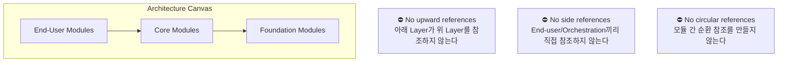
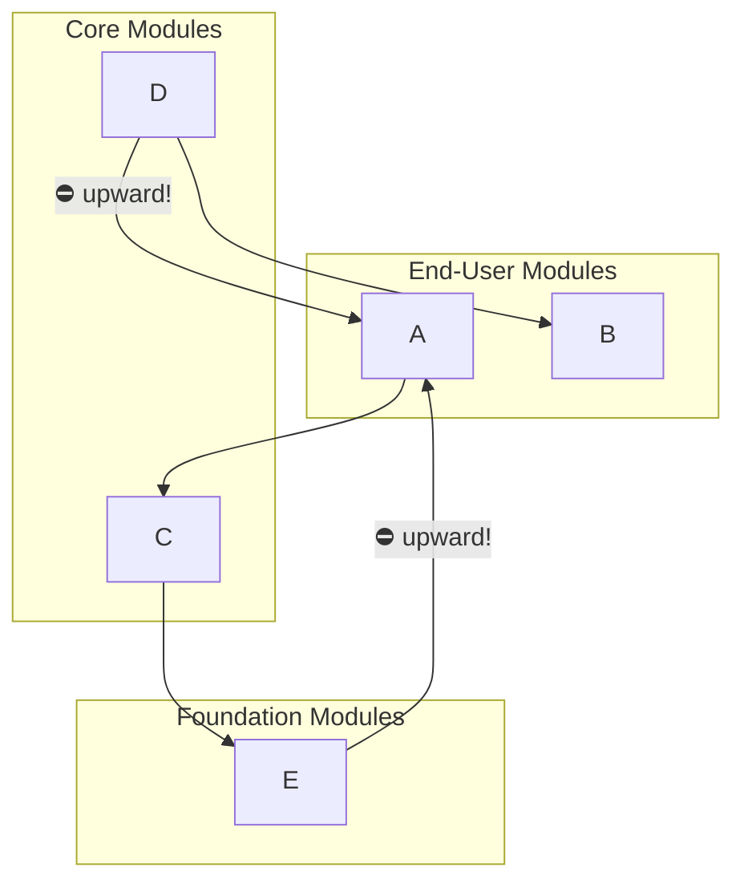
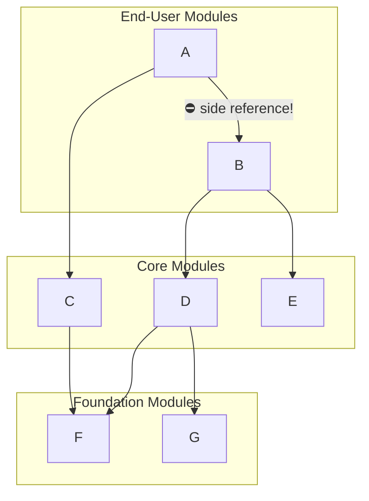
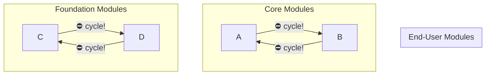

# OutSystems Architecture Specialist (O11)
## 4단원. Validating Your Application Architecture
그림 포함 정리본: 3가지 Architecture Validation Rules

> 🌐 **스타일 버전 (색상/다이어그램 완전 재현):**
> [htmlpreview로 보기](https://htmlpreview.github.io/?https://github.com/kckworld/outsystems_study/blob/main/Architecture%20Specialist%20(O11)/03_Chapter4_Validating_Architecture.html)

---

## 0. 이 단원 한 줄 결론

Architecture Validation은 모듈이 Architecture Canvas 규칙을 잘 지키는지 확인하는 단계입니다. 시험에서는 특히 3가지 금지 규칙이 중요합니다.

- No upward references: 아래 Layer가 위 Layer를 참조하면 안 됨
- No side references among End-users or Orchestrations: End-user/Orchestration끼리 서로 참조하면 안 됨
- No cycles among Cores or Libraries: Core/Library 영역에서도 순환 참조는 안 됨

> *시험용 영어 문장: There are 3 rules you must always comply with in order to achieve a well-designed application architecture.*

---

## 1. 그림 1 - Architecture Validation의 3가지 기본 규칙

*그림 1. Validating your application architecture - 3 validation rules*

그림 설명: Architecture Canvas는 End-user Modules, Core Modules, Foundation Modules로 나누어져 있고, 이 구조에서 반드시 지켜야 할 세 가지 규칙을 보여줍니다.

| 규칙 | 영어 표현 | 의미 |
|---|---|---|
| 1 | No upward references | 아래 Layer가 위 Layer를 참조하지 않는다. |
| 2 | No side references | End-user 또는 Orchestration끼리 직접 참조하지 않는다. |
| 3 | No circular references | 모듈 간 순환 참조를 만들지 않는다. |

Discovery Tool: 구현된 모듈의 dependencies를 분석해서 잘못된 위치에 조립된 actions, screens, entities 같은 요소를 찾아낼 수 있습니다.

---

## 2. Rule #1 - No upward references

*그림 2. Rule #1 - No upward references*

> *영어 핵심: An upward reference tends to create a cluster where any 2 modules, directly or indirectly, have a circular dependency.*

한글 해석: Upward reference는 두 모듈이 직접 또는 간접적으로 서로 순환 의존성을 갖는 클러스터를 만들기 쉽습니다.

그림 해석: Foundation의 E 또는 Core의 C/D가 End-user의 A를 참조하는 식으로 아래에서 위로 올라가는 참조가 생기면, A-C-E-D 같은 모듈들이 하나의 dependency cluster로 묶입니다.

왜 문제인가? Upward violation은 서비스가 제대로 고립되어 있지 않다는 신호입니다. 특히 End-user B가 Core D를 정상적으로 소비하더라도, D가 잘못된 cluster에 묶이면 B까지 불필요한 dependency와 변경 영향에 끌려갑니다.

고치는 법: A에서 소비되는 재사용 요소를 찾아 더 낮은 Layer로 이동합니다. 예를 들어 A 안의 reusable service는 Library나 같은 concept의 lower module로 내려야 합니다.

> ⚠️ 시험 함정: "A가 화면이라도 재사용 Action이 있으니 다른 모듈에서 가져다 쓰자"는 위험합니다. 화면 모듈에 있는 재사용 로직은 아래 Layer로 내려야 합니다.

---

## 3. Rule #2 - No side references among End-users or Orchestrations

*그림 3. Rule #2 - No side references among End-users or Orchestrations*

> *영어 핵심: End-user or Orchestration modules should not provide reusable services.*

한글 해석: End-user 또는 Orchestration 모듈은 재사용 서비스를 제공하면 안 됩니다.

그림 해석: End-user A가 End-user B의 어떤 element를 소비하고 있습니다. 이러면 A는 B뿐만 아니라 B가 의존하는 D, E, G 같은 하위 dependency까지 간접적으로 끌고 옵니다.

왜 문제인가? End-user와 Orchestration은 계층의 맨 위에 있어야 하고, 서로 다른 sponsor나 project team에 의해 서로 다른 lifecycle로 발전해야 합니다. End-user끼리 참조하면 독립적인 lifecycle이 깨지고, 변경 영향이 커집니다.

고치는 법: A가 B에서 소비하는 element를 찾아 lower layer module로 옮깁니다. 업무 관련이면 Core module로, 업무와 무관한 공통 기술이면 Library로 이동합니다.

> ⚠️ 시험 함정: "End-user B에 이미 formatting function이 있으니 A에서 재사용하자"는 틀린 설계입니다. formatting이 업무와 무관하면 Library, 업무와 관련 있으면 Core로 내려야 합니다.

---

## 4. Rule #3 - No cycles among Cores or Libraries

*그림 4. Rule #3 - No cycles among Cores or Libraries*

> *영어 핵심: A cycle is always undesirable, since it brings unexpected impacts and hard-to-manage code.*

한글 해석: Cycle은 예상치 못한 영향과 관리하기 어려운 코드를 만들기 때문에 항상 바람직하지 않습니다.

그림 해석: Core A와 B가 서로 참조하거나, Foundation/Library C와 D가 서로 참조하는 구조가 표시되어 있습니다. End-user는 Rule #1과 #2에 의해 cycle에 참여할 수 없고, 이 규칙은 side reference가 허용될 수 있는 Core/Library 사이에서도 cycle은 금지된다는 의미입니다.

왜 문제인가? Cycle은 두 concept가 제대로 추상화되지 않았다는 신호입니다. A와 B가 서로 너무 강하게 결합되어 있거나, 한쪽 참조 방향이 개념적으로 잘못되어 있을 수 있습니다.

고치는 법: A가 B를 소비하면 안 되는 경우, A에서 B가 소비하던 element를 새 모듈로 옮기거나, 잘못 배치된 동일 concept 요소라면 B 자체로 옮깁니다. 너무 강하게 결합되어 있으면 두 모듈을 합치는 것이 맞을 수 있습니다.

추가 상황: 합쳤더니 모듈이 너무 커지면, 두 base concept 위에 세 번째 모듈을 만들어 composition logic을 담을 수 있습니다.

---

## 5. 3가지 Rule 비교표

| Rule | 금지 구조 | 왜 문제인가 | 대표 해결책 |
|---|---|---|---|
| Rule #1 | Upward reference | Layer가 뒤집히고 circular dependency cluster가 생김 | 재사용 요소를 lower layer로 이동 |
| Rule #2 | End-user/Orchestration side reference | End-user lifecycle 독립성이 깨짐 | 소비되는 element를 Core 또는 Library로 이동 |
| Rule #3 | Cycle among Core/Library | 개념 추상화 실패, 변경 영향 예측 어려움 | 새 모듈로 추출, 잘못 배치된 요소 이동, 필요 시 병합 |

---

## 6. 시험 암기 공식

- 위로 참조하면 안 된다: Foundation → Core, Core → End-user 방향은 위험
- End-user끼리 서로 쓰면 안 된다: 공통 기능은 Core 또는 Library로 내려라
- Core/Library끼리는 side reference가 가능할 수 있지만 cycle은 절대 피한다
- Cycle이 있으면 strong coupling 또는 wrong direction을 의심한다
- 해결책은 move down, extract module, merge modules 중 하나로 판단한다

---

## 7. 실전 문제

**Q1.** A Foundation module consumes an element from an End-user module. Which rule is violated?
> Q1. Foundation 모듈이 End-user 모듈의 element를 소비하고 있다. 어떤 규칙을 위반한 것인가?
- A. No side references / B. No upward references / C. No circular references / D. None of the rules

정답 보기

✅ **정답: B** — No upward references

**Q2.** End-user A consumes a formatting function from End-user B. What is the problem?
> Q2. End-user A가 End-user B의 formatting function을 소비하고 있다. 문제는 무엇인가?
- A. No upward references 위반
- B. No side references among End-users or Orchestrations 위반
- C. No circular references 위반
- D. 문제없다

정답 보기

✅ **정답: B** — No side references among End-users or Orchestrations

**Q3.** Core module A consumes Core module B, and B consumes A. What is the problem?
> Q3. Core 모듈 A가 Core 모듈 B를 소비하고, B가 A를 소비한다. 문제는 무엇인가?
- A. No upward references 위반 / B. No side references 위반 / C. No cycles among Cores or Libraries 위반 / D. 허용되는 구조다

정답 보기

✅ **정답: C** — No cycles among Cores or Libraries

**Q4.** A reusable business-related element is found inside an End-user module. What should you do?
> Q4. 재사용 가능한 업무 관련 element가 End-user 모듈 안에 있다. 어떻게 해야 하는가?
- A. 그대로 둔다 / B. Foundation으로 이동한다 / C. Move it to a Core module or lower conceptual module / D. 모듈을 삭제한다

정답 보기

✅ **정답: C** — Move it to a Core module or lower conceptual module

**Q5.** A reusable business-agnostic function is consumed from an End-user module. Where should it go?
> Q5. 업무와 무관한 재사용 가능한 함수가 End-user 모듈에서 소비되고 있다. 어디로 옮겨야 하는가?
- A. Core / B. Library / C. End-user에 그대로 / D. Foundation Service

정답 보기

✅ **정답: B** — Library

