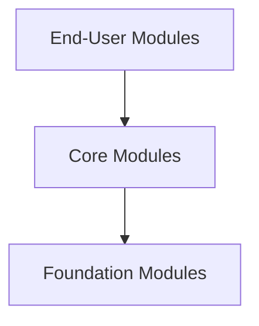
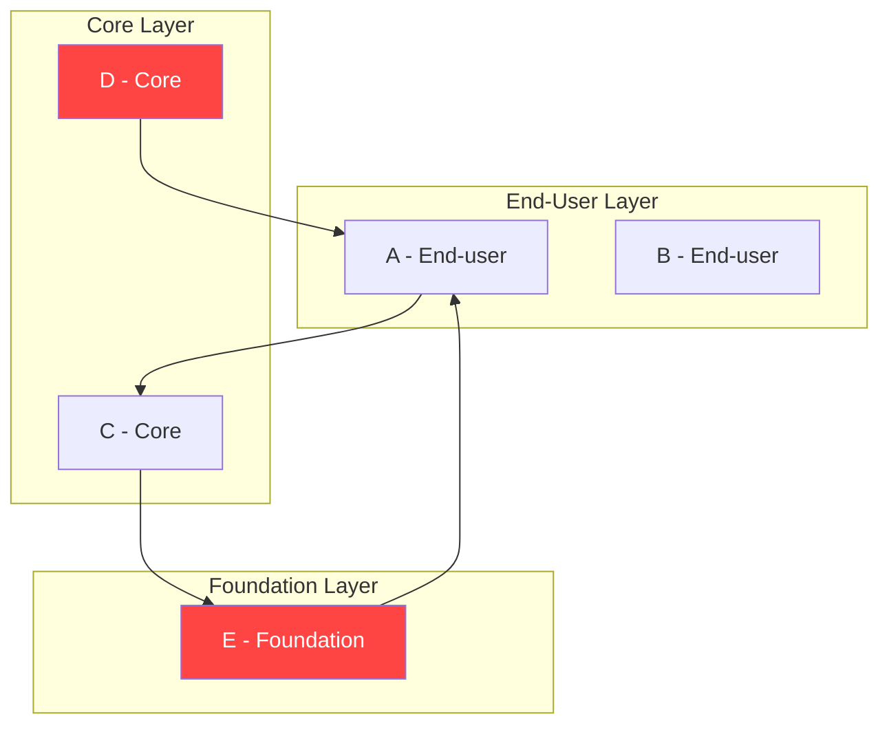
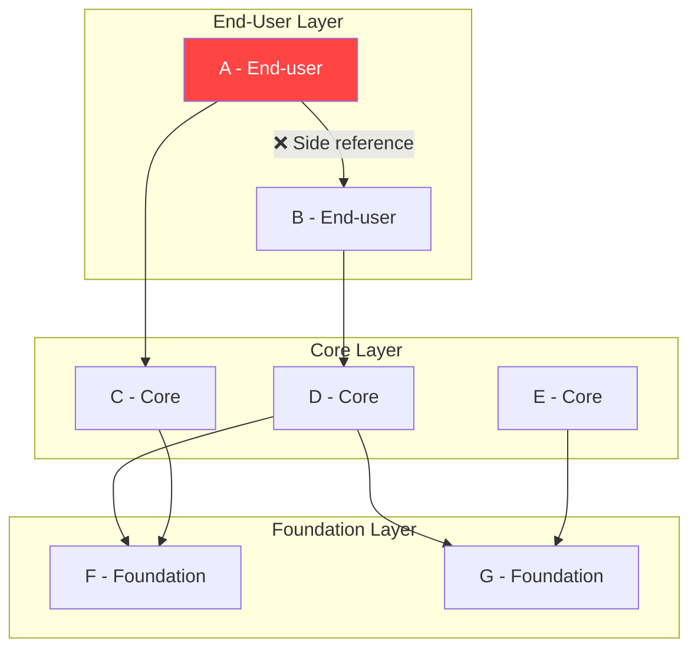
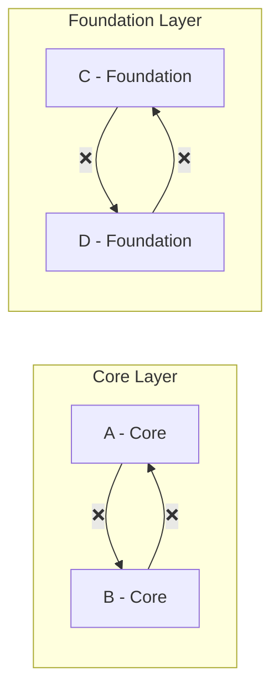

# OutSystems Architecture Specialist (O11)
## 4단원. Validating Your Application Architecture
### 그림 포함 정리본: 3가지 Architecture Validation Rules

---

## 0. 이 단원 한 줄 결론

Architecture Validation은 모듈이 Architecture Canvas 규칙을 잘 지키는지 확인하는 단계.  
시험에서는 특히 **3가지 금지 규칙**이 중요하다.

| 규칙 | 영어 표현 | 의미 |
|---|---|---|
| 1 | No upward references | 아래 Layer가 위 Layer를 참조하지 않는다 |
| 2 | No side references | End-user 또는 Orchestration끼리 직접 참조하지 않는다 |
| 3 | No circular references | 모듈 간 순환 참조를 만들지 않는다 |

> **시험용 영어 문장:** There are 3 rules you must always comply with in order to achieve a well-designed application architecture.

> **Discovery Tool:** 구현된 모듈의 dependencies를 분석해서 잘못된 위치에 조립된 actions, screens, entities 같은 요소를 찾아낼 수 있다.

---

## 1. Architecture Canvas 3-Layer 구조 (전제)

> **허용 방향:** End-User → Core → Foundation (아래 방향만 허용)

---

## 2. Rule #1 - No upward references

> ❌ **위반:** E(Foundation)가 A(End-user)를 참조 → Upward reference

**영어 핵심:**
> An upward reference tends to create a cluster where any 2 modules, directly or indirectly, have a circular dependency.

**왜 문제인가?**
- Upward violation은 서비스가 제대로 고립되어 있지 않다는 신호
- End-user B가 Core D를 정상적으로 소비하더라도, D가 잘못된 cluster에 묶이면 B까지 불필요한 dependency와 변경 영향에 끌려간다

**고치는 법:**
- A에서 소비되는 재사용 요소를 찾아 더 낮은 Layer로 이동
- A 안의 reusable service는 Library나 같은 concept의 lower module로 내려야 함

> ⚠️ **시험 함정:** "A가 화면이라도 재사용 Action이 있으니 다른 모듈에서 가져다 쓰자"는 위험하다. 화면 모듈에 있는 재사용 로직은 아래 Layer로 내려야 한다.

---

## 3. Rule #2 - No side references among End-users or Orchestrations

> ❌ **위반:** End-user A가 End-user B의 element를 소비

**영어 핵심:**
> End-user or Orchestration modules should not provide reusable services.

**왜 문제인가?**
- End-user와 Orchestration은 계층의 맨 위에 있어야 하고, 서로 다른 sponsor나 project team에 의해 서로 다른 lifecycle로 발전해야 한다
- End-user끼리 참조하면 독립적인 lifecycle이 깨지고, 변경 영향이 커진다

**고치는 법:**
- A가 B에서 소비하는 element를 찾아 lower layer module로 옮긴다
- 업무 관련이면 **Core module**로, 업무와 무관한 공통 기술이면 **Library**로 이동

> ⚠️ **시험 함정:** "End-user B에 이미 formatting function이 있으니 A에서 재사용하자"는 틀린 설계. formatting이 업무와 무관하면 Library, 업무와 관련 있으면 Core로 내려야 한다.

---

## 4. Rule #3 - No cycles among Cores or Libraries

> ❌ **위반:** Core A ↔ Core B 순환 참조 / Foundation C ↔ Foundation D 순환 참조

**영어 핵심:**
> A cycle is always undesirable, since it brings unexpected impacts and hard-to-manage code.

**왜 문제인가?**
- Cycle은 두 concept가 제대로 추상화되지 않았다는 신호
- A와 B가 서로 너무 강하게 결합되어 있거나, 한쪽 참조 방향이 개념적으로 잘못되어 있을 수 있다

**고치는 법:**

| 상황 | 해결책 |
|---|---|
| A가 B를 소비하면 안 되는 경우 | A에서 B가 소비하던 element를 새 모듈로 옮기거나 B 자체로 이동 |
| 너무 강하게 결합되어 있으면 | 두 모듈을 합치기 |
| 합쳤더니 너무 커지면 | 두 base concept 위에 세 번째 모듈을 만들어 composition logic을 담기 |

---

## 5. 3가지 Rule 비교표

| Rule | 금지 구조 | 왜 문제인가 | 대표 해결책 |
|---|---|---|---|
| Rule #1 | Upward reference | Layer가 뒤집히고 circular dependency cluster가 생김 | 재사용 요소를 lower layer로 이동 |
| Rule #2 | End-user/Orchestration side reference | End-user lifecycle 독립성이 깨짐 | 소비되는 element를 Core 또는 Library로 이동 |
| Rule #3 | Cycle among Core/Library | 개념 추상화 실패, 변경 영향 예측 어려움 | 새 모듈로 추출, 잘못 배치된 요소 이동, 필요 시 병합 |

---

## 6. 시험 암기 공식

- 위로 참조하면 안 된다: Foundation → Core, Core → End-user 방향은 위험
- End-user끼리 서로 쓰면 안 된다: 공통 기능은 Core 또는 Library로 내려라
- Core/Library끼리는 side reference가 가능할 수 있지만 **cycle은 절대 피한다**
- Cycle이 있으면 strong coupling 또는 wrong direction을 의심한다
- 해결책은 **move down, extract module, merge modules** 중 하나로 판단한다

---

## 7. 실전 문제

| 번호 | Question | 정답 방향 |
|---|---|---|
| Q1 | A Foundation module consumes an element from an End-user module. Which rule is violated? | No upward references |
| Q2 | End-user A consumes a formatting function from End-user B. What is the problem? | No side references among End-users or Orchestrations |
| Q3 | Core module A consumes Core module B, and B consumes A. What is the problem? | No cycles among Cores or Libraries |
| Q4 | A reusable business-related element is found inside an End-user module. What should you do? | Move it to a Core module or lower conceptual module |
| Q5 | A reusable business-agnostic function is consumed from an End-user module. Where should it go? | Library |
