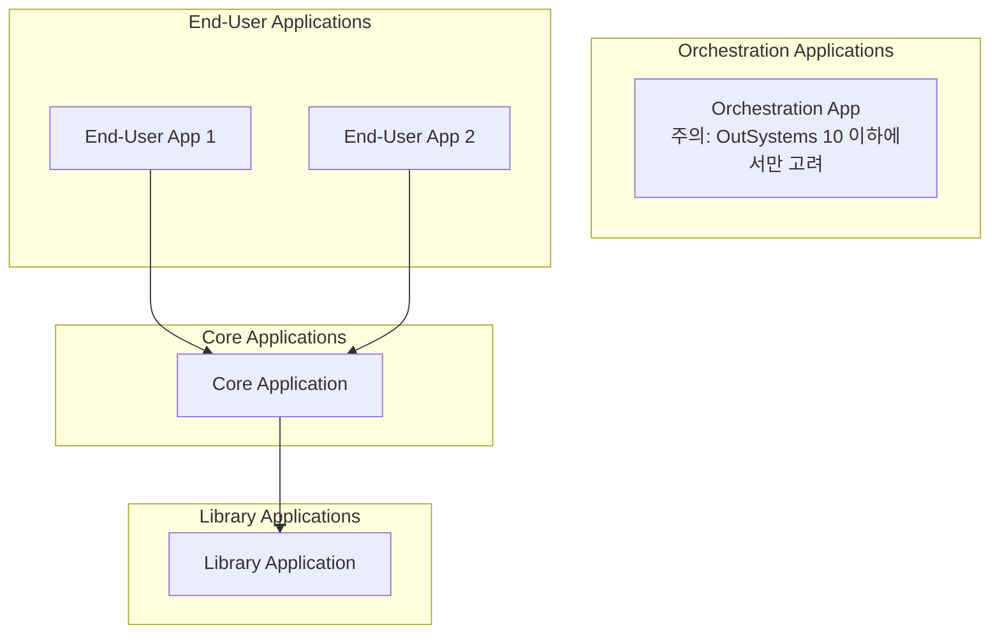
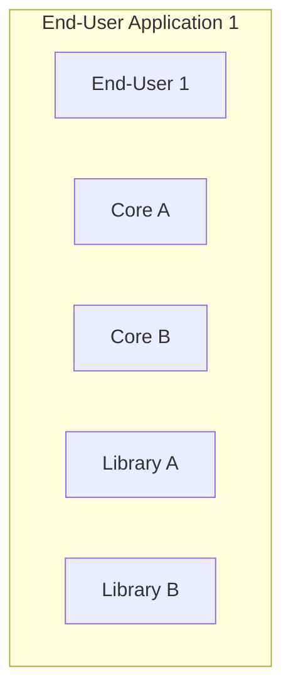
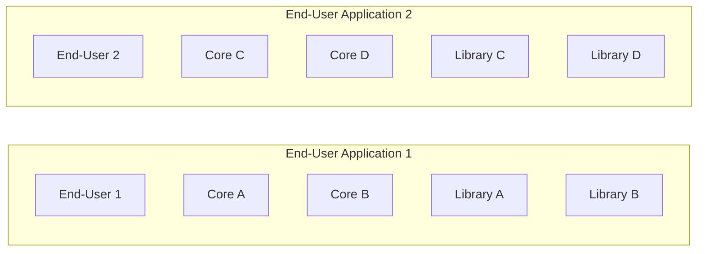
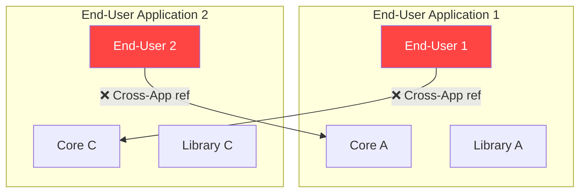
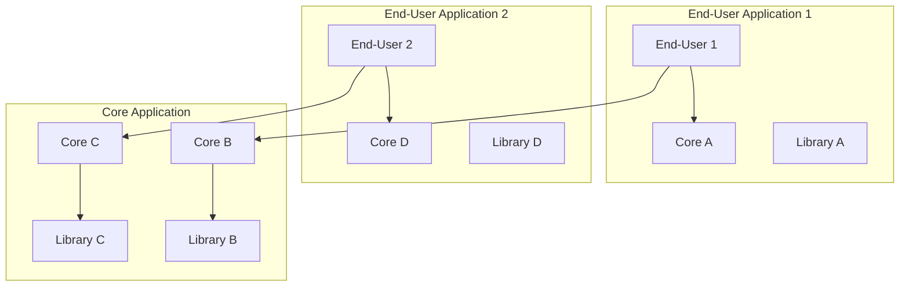

# OutSystems Architecture Specialist (O11)
## 5단원. Application Composition
### Applying the Architecture Canvas to Applications

---

## 이 단원 한 줄 결론

- Application도 Module처럼 Architecture Canvas Layer에 배치된다.
- Application의 Layer는 그 안에 있는 **top-most module의 성격**을 따른다.
- 잘못 묶으면 End-user Application끼리 side reference/cycle이 생기고, 독립 배포가 깨진다.
- 공통으로 재사용되는 Core/Library 리소스는 **별도 Core Application으로 격리**한다.

---

## 1. Applying the Architecture Canvas to Applications

**영어 핵심:**
> Each application is also placed in one of the layers.  
> Applications should be placed in the same layer as the **top-most module** in it.

### Top-most module 기준이란?

| Application 안에 들어있는 Module 조합 | Application Layer | 판단 이유 |
|---|---|---|
| End-user + Core + Library | End-user Application | End-user가 가장 위 Layer |
| Core + Library | Core Application | Core가 가장 위 Layer |
| Library만 포함 | Library Application | 공통 Foundation/Library만 포함 |
| Orchestration + End-user + Core | Orchestration Application | Orchestration이 가장 위 Layer |

---

## 2. Application Layer 구조

| 그림 영역 | 포함 가능한 Module 성격 | 시험 포인트 |
|---|---|---|
| Orchestration Applications | 여러 frontend를 묶어 통합 사용자 경험/업무 흐름 제공 | OutSystems 10 이하에서만 고려한다는 주석 있음 |
| End-User Applications | End-user module + 필요한 Core/Library module | 화면 앱은 내부에 Core/Library를 포함할 수 있지만 Application 성격은 End-user |
| Core Applications | Core module + Library module | 재사용 업무 개념, 비즈니스 규칙 중심 |
| Library Applications | Library/Foundation module만 포함 | 공통 기술/공통 UI/공통 서비스 중심 |

---

## 3. Application에도 같은 Validation Rule이 적용된다

| 규칙 | Application 기준 예시 | 문제 |
|---|---|---|
| No upward references | Library Application → End-user Application | 아래 성격의 Application이 위 Application을 참조 |
| No side references | End-user App 1 → End-user App 2 | 최상위 앱끼리 lifecycle이 묶임 |
| No cyclic references | App 1 → App 2 → App 1 | 배포/변경 영향이 서로 묶임 |

---

## 4. First Project: 하나의 Application으로 시작

첫 프로젝트에서는 여러 Application을 미리 나누기보다, 하나의 프로젝트를 하나의 Application으로 시작한다.

| 구성요소 | 의미 | 처음에는 왜 가능할 수 있나 |
|---|---|---|
| End-User #1 | 화면/사용자 프로세스 | 해당 프로젝트의 사용자 기능 |
| Core A / Core B | 업무 개념/비즈니스 규칙 | 오직 이 Application 내부에서만 소비됨 |
| Library A / Library B | 공통 기반/기술 기능 | 오직 이 Application 내부에서만 소비됨 |

---

## 5. Second Project: 두 번째 Application 추가

이 시점까지는 두 Application이 서로 참조하지 않으므로 문제가 없다.

---

## 6. Third Project: 문제가 발생하는 순간

| 참조 | Module 관점 | Application 관점 |
|---|---|---|
| End-user #1 → Core C | End-user가 Core 사용이라 정상처럼 보임 | Core C가 End-user App 2 안에 있으므로 **App 1 → App 2**가 됨 |
| End-user #2 → Core B | End-user가 Core 사용이라 정상처럼 보임 | Core B가 End-user App 1 안에 있으므로 **App 2 → App 1**이 됨 |

> ⚠️ **핵심 문제:** Module Architecture에는 위반이 없어 보일 수 있지만, Application Composition 기준으로는 **End-user Application 1 ↔ End-user Application 2 cycle**이 생긴다.

---

## 7. Solving the Issues: Core Application으로 분리

| 이동 대상 | 왜 이동해야 하나 |
|---|---|
| Core B / Core C | 두 End-user Application에서 직접 재사용되는 핵심 업무 리소스 |
| Library B / Library C | Core B/Core C의 dependency이므로 같이 이동해야 upward reference를 피할 수 있음 |

> ⚠️ **잘못된 해결:** Core B와 Core C만 Core Application으로 이동하고 Library B, C는 End-user Application에 남겨두면, Core Application → End-user Application 방향의 **upward reference**가 발생할 수 있다.

---

## 8. 최종 시험 공식

| 상황 | 판단 | 해결 |
|---|---|---|
| Application 안의 top-most module이 End-user | End-user Application | 화면/사용자 프로세스 앱으로 판단 |
| End-user App 1이 End-user App 2 안의 Core를 사용 | Application side reference 가능성 | 공통 Core를 Core Application으로 이동 |
| 두 End-user Apps가 서로의 Core를 사용 | Application cycle | 공통 리소스를 별도 Core Application으로 분리 |
| Core만 옮기고 그 Dependency는 End-user App에 남김 | Upward reference 위험 | Dependency도 함께 이동 |

### 암기 문장
- Applications should be placed in the **same layer as the top-most module** in it.
- End-user applications should **not** provide reusable services to other applications.
- Commonly reused resources must be isolated in a **new application**, usually a Core Application.
- Move directly referenced Core modules **and all their dependencies** to avoid upward references.

---

## 9. 시험 함정 포인트

| 함정 | 정답 방향 |
|---|---|
| Module Architecture만 맞으면 Application도 자동으로 맞다 | Application Composition도 별도 검증 필요 |
| End-user가 Core를 참조했으니 항상 문제 없다 | Core가 어느 Application에 들어있는지 확인해야 함 |
| 공통 Core를 End-user Application 안에 계속 둬도 된다 | 다른 Application이 재사용하면 Core Application으로 분리 |
| Core만 이동하면 끝이다 | Core의 dependencies도 같이 이동해야 upward reference 방지 |
| Application은 아무렇게나 묶어도 개별 배포 가능하다 | Application은 LifeTime의 최소 배포 단위이므로 Composition이 중요 |

---

## 10. 실전 문제

**Q1.** Applications should be placed in the same layer as:
- A. The lowest module in the application
- **B. The top-most module in the application** ✅
- C. The first module created
- D. The module with the most entities

**Q2.** Two End-user Applications start consuming Core modules inside each other. What is the main issue?
- A. No module architecture violation can ever exist
- **B. The applications may become strongly coupled and form a cycle** ✅
- C. Core modules cannot be reused
- D. Libraries must be deleted

**Q3.** How should commonly reused Core resources be handled?
- A. Keep them inside one End-user Application
- **B. Move them to a new Core Application** ✅
- C. Move them to the UI theme
- D. Duplicate them in each End-user Application

**Q4.** When moving Core B and Core C to a Core Application, what else should be moved?
- A. All users
- **B. Their dependencies such as Library B and Library C** ✅
- C. All End-user screens
- D. Nothing else
