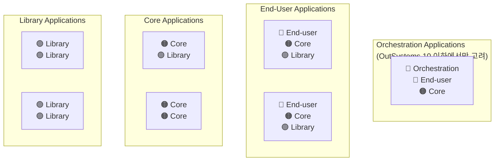
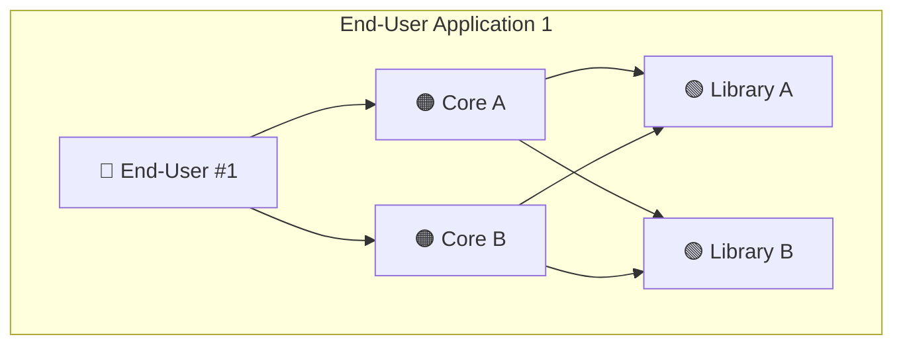
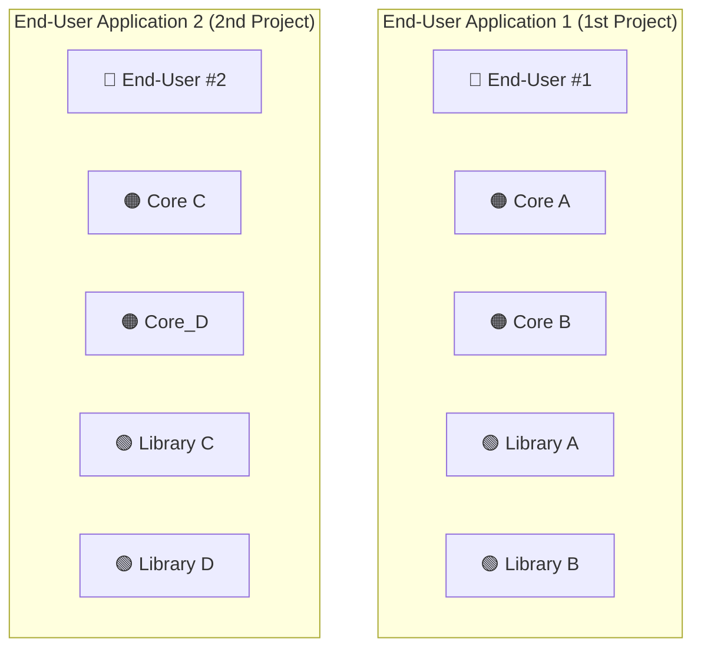
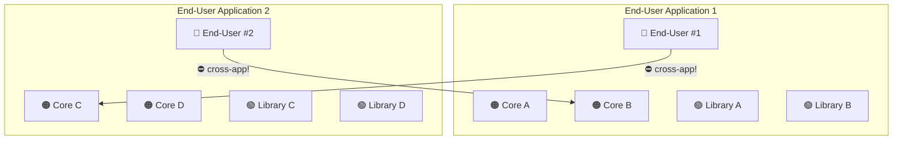
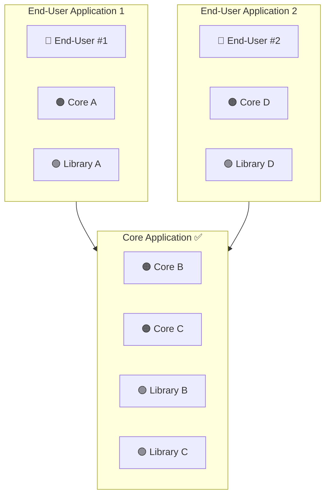

# 5단원. Application Composition
## Applying the Architecture Canvas to Applications
OutSystems Architecture Specialist (O11) 벼락치기 학습 노트

> 🌐 **스타일 버전 (색상/다이어그램 완전 재현):**
> [htmlpreview로 보기](https://htmlpreview.github.io/?https://github.com/kckworld/outsystems_study/blob/main/Architecture%20Specialist%20(O11)/04_Chapter5_Application_Composition.html)

---

> **이 단원 한 줄 결론**
> - Application도 Module처럼 Architecture Canvas Layer에 배치된다.
> - Application의 Layer는 그 안에 있는 **top-most module의 성격**을 따른다.
> - 잘못 묶으면 End-user Application끼리 side reference/cycle이 생기고, 독립 배포가 깨진다.
> - 공통으로 재사용되는 Core/Library 리소스는 **별도 Core Application으로 격리**한다.

---

## 1. Applying the Architecture Canvas to applications

*그림 1. Application도 Architecture Canvas 원칙에 따라 Layer에 배치된다.*

### 영어 원문 핵심

- **EN:** To analyze the application architecture, the Architecture Canvas principles play a major role, just like with module architecture.
  **KR:** 애플리케이션 아키텍처를 분석할 때도, 모듈 아키텍처와 마찬가지로 Architecture Canvas 원칙이 중요한 역할을 한다.

- **EN:** Each application is also placed in one of the layers.
  **KR:** 각 Application도 Layer 중 하나에 배치된다.

- **EN:** Applications should be placed in the same layer as the top-most module in it.
  **KR:** Application은 그 안에 포함된 가장 위쪽(top-most) Module과 같은 Layer에 배치되어야 한다.

---

## 2. Top-most module 기준이란?

Application은 여러 Module과 Extension의 묶음입니다. 그런데 이 Application을 End-user Application, Core Application, Library Application 중 어디로 볼지는 "그 안에 포함된 가장 위쪽 Layer의 Module"이 결정합니다.

| Application 안에 들어있는 Module 조합 | Application Layer 판단 | 이유 |
|---|---|---|
| End-user + Core + Library | End-user Application | End-user가 가장 위 Layer |
| Core + Library | Core Application | Core가 가장 위 Layer |
| Library만 포함 | Library Application | 공통 Foundation/Library만 포함 |
| Orchestration + End-user + Core | Orchestration Application | Orchestration이 가장 위 Layer |

---

## 3. 그림 1의 Application Layer 설명

| 그림 영역 | 포함 가능한 Module 성격 | 시험 포인트 |
|---|---|---|
| Orchestration Applications | 여러 frontend를 묶어 통합 사용자 경험/업무 흐름 제공 | OutSystems 10 이하에서만 고려한다는 주석이 있음 |
| End-User Applications | End-user module + 필요한 Core/Library module | 화면 앱은 내부에 Core/Library를 포함할 수 있지만 Application 성격은 End-user |
| Core Applications | Core module + Library module | 재사용 업무 개념, 비즈니스 규칙 중심 |
| Library Applications | Library/Foundation module만 포함 | 공통 기술/공통 UI/공통 서비스 중심 |

> **중요: Application도 Validation Rule을 따른다**
> - No upward references
> - No side references among End-user applications or Orchestration applications
> - No cyclic references between two applications

---

## 4. Application에서도 같은 Validation Rule이 적용된다

본문은 Module에서 적용했던 규칙을 Application 사이에도 똑같이 적용한다고 설명합니다. 즉, Module Architecture가 좋아도 Application Composition이 잘못되면 배포 단위와 lifecycle이 망가질 수 있습니다.

| 규칙 | Application 기준 예시 | 문제 |
|---|---|---|
| No upward references | Library Application → End-user Application | 아래 성격의 Application이 위 Application을 참조 |
| No side references | End-user App 1 → End-user App 2 | 최상위 앱끼리 lifecycle이 묶임 |
| No cyclic references | App 1 → App 2 → App 1 | 배포/변경 영향이 서로 묶임 |

---

## 5. End-user Application 안에 Core/Library를 넣을 수 있는 조건

본문은 "End-user application can contain reusable Core and Library modules, as long as they are consumed only by other modules of the same application"이라고 말합니다. 즉, End-user Application 내부 전용으로만 쓰는 Core/Library라면 처음에는 같이 있어도 됩니다.

**허용되는 경우**
- End-user App 1 안의 Core A, Core B, Library A, Library B가 오직 End-user App 1 내부에서만 쓰임
- 다른 Application에서 이 Core/Library를 참조하지 않음
- Application 단위로 독립적인 lifecycle 유지 가능

**문제가 되는 경우**
- End-user App 2가 End-user App 1 안의 Core B를 참조하기 시작함
- End-user App 1이 End-user App 2 안의 Core C를 참조하기 시작함
- Application끼리 side reference 또는 cycle이 생김

---

## 6. First project: 첫 프로젝트에서는 하나의 Application으로 시작할 수 있다

*그림 2. First project: 하나의 End-user Application 안에 End-user/Core/Library가 함께 들어간 초기 구조.*

첫 프로젝트에서는 보통 여러 Application을 미리 나누기보다, 하나의 프로젝트를 하나의 Application으로 시작합니다. 그림에서는 End-User Application 1 안에 End-User #1, Core A, Core B, Library A, Library B가 모두 들어 있습니다.

| 구성요소 | 의미 | 처음에는 왜 가능할 수 있나 |
|---|---|---|
| End-User #1 | 화면/사용자 프로세스 | 해당 프로젝트의 사용자 기능 |
| Core A / Core B | 업무 개념/비즈니스 규칙 | 오직 이 Application 내부에서만 소비됨 |
| Library A / Library B | 공통 기반/기술 기능 | 오직 이 Application 내부에서만 소비됨 |

---

## 7. Second project: 비슷한 두 번째 프로젝트가 생김

*그림 3. Second project: 별도 비즈니스 프로세스용 End-user Application 2가 추가된다.*

두 번째 프로젝트에서는 다른 비즈니스 프로세스를 위한 End-user Application 2가 만들어지고, 그 안에 End-User #2, Core C, Core_D, Library C, Library D가 들어갑니다. 이 시점까지는 두 Application이 서로 참조하지 않으므로 문제가 없습니다.

---

## 8. Third project: 문제가 발생하는 순간

*그림 4. Third project: End-user App끼리 서로의 Core를 참조하면서 Application cycle이 발생한다.*

세 번째 진화 프로젝트에서 End-user #1이 Core C를 재사용하고, End-user #2가 Core B를 재사용하기 시작합니다. Module 관점에서는 End-user가 Core를 참조하므로 위에서 아래 방향이라 문제가 없어 보일 수 있습니다. 하지만 Application 관점에서는 다릅니다.

| 참조 | Module 관점 | Application 관점 |
|---|---|---|
| End-user #1 → Core C | End-user가 Core 사용이라 정상처럼 보임 | Core C가 End-user App 2 안에 있으므로 App 1 → App 2가 됨 |
| End-user #2 → Core B | End-user가 Core 사용이라 정상처럼 보임 | Core B가 End-user App 1 안에 있으므로 App 2 → App 1이 됨 |

> **핵심 문제**
> - Module Architecture에는 위반이 없어 보일 수 있다.
> - 하지만 Application Composition 기준으로는 End-user Application 1 ↔ End-user Application 2 cycle이 생긴다.
> - 둘이 강하게 결합되어 하나를 Production에 배포할 때 다른 하나도 따라가야 할 수 있다.

---

## 9. Solving the issues: 공통 재사용 리소스를 새 Core Application으로 이동

*그림 5. Solving the issues: 공통 재사용 리소스를 Core Application으로 격리한다.*

해결책은 두 End-user Application에서 공통으로 재사용되는 리소스를 새 Application으로 격리하는 것입니다. 그림에서는 Core B와 Core C를 Core Application으로 이동하고, 이 Core들이 의존하는 Library B와 Library C도 함께 이동합니다.

| 이동 대상 | 왜 이동해야 하나 |
|---|---|
| Core B / Core C | 두 End-user Application에서 직접 재사용되는 핵심 업무 리소스 |
| Library B / Library C | Core B/Core C의 dependency이므로 같이 이동해야 upward reference를 피할 수 있음 |

---

## 10. 왜 Library B와 Library C도 같이 옮기나?

본문은 Core B와 Core C뿐 아니라 그들의 dependency인 Library B와 Library C도 Core Application으로 옮겨야 한다고 설명합니다. 이유는 Core Application 안의 Core가 다시 End-user Application 내부의 Library를 참조하면 Application 기준 upward reference가 생길 수 있기 때문입니다.

> ⚠️ **잘못된 해결**
> - Core B와 Core C만 Core Application으로 이동
> - Library B와 Library C는 원래 End-user Application 안에 남겨둠
> - 그러면 Core Application → End-user Application 방향의 upward reference가 발생할 수 있음

정답 보기

✅ **올바른 해결**

> - Core B와 Core C를 Core Application으로 이동
> - Core B/Core C가 의존하는 Library B와 Library C도 함께 이동
> - End-user Application 1과 2는 둘 다 Core Application을 참조
> - 두 End-user Application이 서로 직접 참조하지 않음

---

## 11. 최종 시험 공식

| 상황 | 판단 | 해결 |
|---|---|---|
| Application 안의 top-most module이 End-user | End-user Application | 화면/사용자 프로세스 앱으로 판단 |
| End-user App 1이 End-user App 2 안의 Core를 사용 | Application side reference 가능성 | 공통 Core를 Core Application으로 이동 |
| 두 End-user Apps가 서로의 Core를 사용 | Application cycle | 공통 리소스를 별도 Core Application으로 분리 |
| Core만 옮기고 그 Dependency는 End-user App에 남김 | Upward reference 위험 | Dependency도 함께 이동 |

> **암기 문장**
> - Applications should be placed in the same layer as the top-most module in it.
> - End-user applications should not provide reusable services to other applications.
> - Commonly reused resources must be isolated in a new application, usually a Core Application.
> - Move directly referenced Core modules and all their dependencies to avoid upward references.

---

## 12. 시험 함정 포인트

| 함정 | 정답 방향 |
|---|---|
| Module Architecture만 맞으면 Application도 자동으로 맞다 | 틀림. Application Composition도 별도 검증 필요 |
| End-user가 Core를 참조했으니 항상 문제 없다 | Core가 어느 Application에 들어있는지 확인해야 함 |
| 공통 Core를 End-user Application 안에 계속 둬도 된다 | 다른 Application이 재사용하면 Core Application으로 분리 |
| Core만 이동하면 끝이다 | Core의 dependencies도 같이 이동해야 upward reference 방지 |
| Application은 아무렇게나 묶어도 LifeTime에서 개별 배포 가능하다 | Application은 LifeTime의 최소 배포 단위이므로 Composition이 중요 |

---

## 13. 실전 문제

**Q1.** Applications should be placed in the same layer as:
> Q1. Application은 무엇과 같은 Layer에 배치되어야 하는가?
- A. The lowest module in the application / B. The top-most module in the application / C. The first module created / D. The module with the most entities

정답 보기

✅ **정답: B**

**Q2.** Two End-user Applications start consuming Core modules inside each other. What is the main issue?
> Q2. 두 End-user Application이 서로 상대방의 Core 모듈을 소비하기 시작했다. 주요 문제는?
- A. No module architecture violation can ever exist
- B. The applications may become strongly coupled and form a cycle
- C. Core modules cannot be reused
- D. Libraries must be deleted

정답 보기

✅ **정답: B**

**Q3.** How should commonly reused Core resources be handled?
> Q3. 공통으로 재사용되는 Core 리소스는 어떻게 처리해야 하는가?
- A. Keep them inside one End-user Application / B. Move them to a new Core Application / C. Move them to the UI theme / D. Duplicate them in each End-user Application

정답 보기

✅ **정답: B**

**Q4.** When moving Core B and Core C to a Core Application, what else should be moved?
> Q4. Core B와 Core C를 Core Application으로 이동할 때, 함께 이동해야 할 것은?
- A. All users / B. Their dependencies such as Library B and Library C / C. All End-user screens / D. Nothing else

정답 보기

✅ **정답: B**

