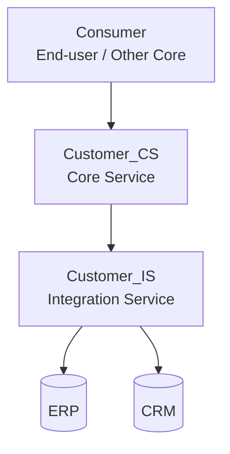
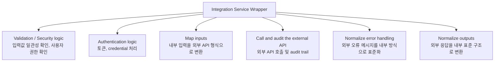
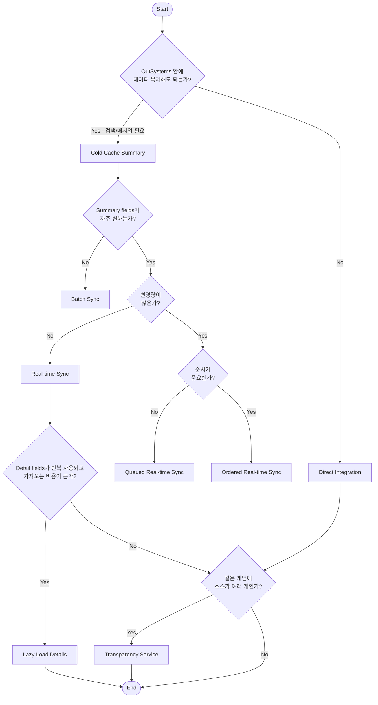
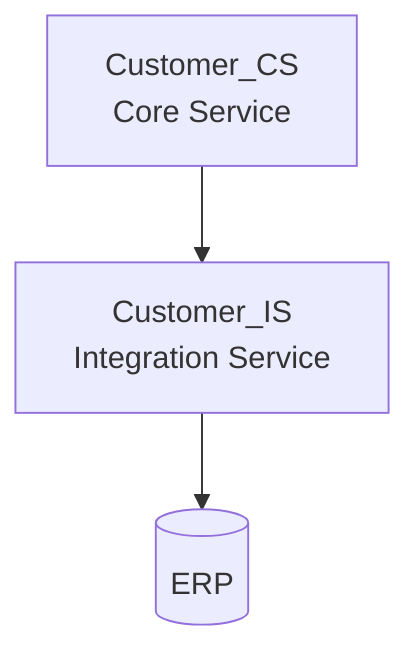

# OutSystems Architecture Specialist (O11)
## Integration Patterns for Core Services Abstraction

---

## 핵심 결론

이 단원은 외부 시스템(ERP, CRM 등)을 OutSystems Core Service에서 직접 알지 못하게 숨기고, **Integration Service**가 외부 API/프로토콜/인증/오류 처리를 감싸도록 만드는 설계 패턴이다.

시험에서는:
- "누가 외부 시스템을 알아야 하는가?"
- "Integration Service를 시스템별로 만들지 개념별로 만들지"
- "캐시/동기화/직접연계 중 무엇을 선택할지"

를 묻는다.

---

## 1. 왜 Integration Pattern이 필요한가?

| 필요성 | 설명 | 시험 키워드 |
|---|---|---|
| System independence | ERP/CRM 같은 외부 시스템이 바뀌어도 Core Service와 화면 앱이 크게 흔들리지 않게 한다 | resilient to external changes |
| Extensibility | 외부 데이터에 내부 비즈니스 규칙이나 보완 정보를 더할 수 있다 | extend the concept |
| Normalization | 외부 시스템마다 다른 구조를 내부 표준 구조로 변환한다 | normalize representations |
| Optimization | 필요한 경우 캐시/동기화를 사용해 성능을 개선한다 | cache information |

> ⚠️ **시험 함정:** "외부 시스템이 ERP 하나니까 End-user 앱에서 ERP API를 직접 호출하면 된다"는 식의 답은 위험하다. 외부 연계를 Integration Service로 감싸고, Core Service 소비자는 외부 시스템을 몰라야 한다.

---

## 2. Core Service와 Integration Service 구조

| 구성요소 | 역할 | 시험 판단 |
|---|---|---|
| Customer_CS | Core Service. Customer라는 업무 개념을 내부에 안정적으로 제공한다 | Consumer가 사용하는 추상화 계층 |
| Customer_IS | Integration Service. ERP/CRM API를 감싸고 내부 구조에 맞게 변환한다 | 외부 시스템 복잡성을 숨김 |
| ERP / CRM | 실제 System of Record 또는 외부 시스템 | Core/End-user가 직접 알아야 할 대상이 아님 |

| 번호 | 역할 | 한글 설명 |
|---|---|---|
| 1 - Core Service | Extend the original service / System agnostic | Core Service는 원래 서비스를 확장하고, 특정 외부 시스템에 종속되지 않아야 한다 |
| 2 - Integration Service | Abstracts the original API(s) | 원 API를 감싸고, 내부 구조와 개념에 맞게 매핑한다 |
| 2 - Integration Service | Hide the integration type | REST, SOAP, HTTP request, file upload 등 세부 연계 방식을 숨긴다 |
| 2 - Integration Service | Cope with technical requirements | 인증, 권한, 에러 처리, 감사 로그 같은 기술 요구사항을 처리한다 |

---

## 3. 핵심 원칙 - 시스템별이 아니라 개념별 Integration Service

**영어 시험 문장:**
> The idea is to have an Integration Service per independent concept and **not** a single integration point per external system.

| 나쁜 설계 | 좋은 설계 |
|---|---|
| ERP_IS 하나에 Customer, Product, Order를 모두 넣음 | Customer_IS, Product_IS, Order_IS처럼 개념별 분리 |
| Consumer가 ERP/CRM 차이를 알아야 함 | Consumer는 Customer_CS만 보고 외부 시스템을 모름 |
| Products 변경이 Customers 소비자에게 영향 가능 | 각 개념이 독립 lifecycle을 가짐 |

---

## 4. Integration Wrapper Canvas

| Wrapper Canvas 항목 | 한글 설명 | 시험 포인트 |
|---|---|---|
| Validation / Security logic | 입력값 일관성 확인, 사용자 권한 확인 | 권한/검증은 호출 전 체크 |
| Authentication logic | 외부 API 호출에 필요한 인증 정보 준비 | 토큰, credential 처리 |
| Map inputs | 내부 입력을 외부 API 형식으로 변환 | 내부 모델과 외부 모델 분리 |
| Call and audit the external API | 외부 API 호출 및 필요 시 감사 기록 | audit trail |
| Normalize error handling | 외부 API 성공/오류 메시지를 내부 방식으로 표준화 | 오류 메시지 그대로 반환은 위험 |
| Normalize outputs | 외부 응답을 내부 표준 구조로 변환 | Consumer가 외부 구조를 몰라야 함 |
| Exception handling | 보통 caller가 예외를 처리하지만, 통합 예외 메시지 표준화에 사용 가능 | 무조건 여기서 다 처리한다는 의미는 아님 |

---

## 5. Summary fields와 Detail fields

| 구분 | 영어 설명 | 한글 설명 | 예시 |
|---|---|---|---|
| Summary fields | Used for listing or searching entries | 목록/검색에 필요한 필드. 보통 자주 바뀌지 않음 | Customer name, Customer city |
| Detail fields | Only required to display details for a single entry | 단건 상세 화면에서만 필요한 필드. 자주 바뀌거나 민감할 수 있음 | Customer balance |

> ⚠️ **시험 함정:** 상세 필드가 민감하거나 자주 바뀌면 무조건 복제하지 않고 **Lazy Load Details** 같은 패턴을 고려한다.

---

## 6. Integration Pattern 결정 트리

| 패턴 | 언제 선택? | 핵심 의미 |
|---|---|---|
| Direct Integration | 복제하지 않고 외부 시스템을 직접 조회/처리해야 할 때 | Integration Service를 통한 직접 연계 |
| Cold Cache Summary | 검색/목록/매시업을 위해 일부 Summary 데이터를 OutSystems에 보관할 때 | 조회 성능과 scaffold/search 지원 |
| Batch Sync | Summary 데이터가 자주 변하지 않을 때 | 일정 주기 동기화 |
| Real-time Sync | 변경량이 낮고 빠른 반영이 필요할 때 | 즉시 동기화 |
| Queued Real-time Sync | 변경량이 높아 비동기 큐 처리가 필요할 때 | 큐로 부하 완화 |
| Ordered Real-time Sync | 업데이트 순서가 중요할 때 | 순서 보장 동기화 |
| Lazy Load Details | 상세 필드가 반복 사용되고 가져오는 비용이 클 때 | 상세 데이터는 필요 시 로딩 |
| Transparency Service | 같은 개념의 데이터 소스가 여러 개일 때 | Consumer에게 소스 차이를 숨김 |

---

## 7. Direct Integration 패턴

**영어 시험 문장:**
> This pattern simply represents a direct integration with the external system, **using the Integration Service for service abstraction**.

> ⚠️ Direct Integration은 외부 시스템과 직접 통신하는 패턴이지만, End-user나 Core Consumer가 ERP를 직접 호출한다는 뜻이 **아니다**. Integration Service를 통한 service abstraction이 핵심.

---

## 8. 시험 함정 포인트

- Integration Service는 외부 시스템별 하나가 아니라 **독립적인 업무 개념별**로 설계하는 것이 기본 방향이다.
- Core Service 소비자는 ERP/CRM 같은 외부 system of record를 몰라야 한다.
- REST/SOAP/File Upload 같은 기술 방식은 Integration Service 안에 숨긴다.
- Customer_IS처럼 특정 업무 개념에 묶이면 Core Services Abstraction 맥락에서 Core 개념 주변에 배치될 수 있다.
- Summary fields는 목록/검색용이고, Detail fields는 단건 상세용이다. 이 구분이 동기화 패턴 선택 기준이다.

---

## 9. 30초 복습 키워드

| 키워드 | 바로 떠올릴 내용 |
|---|---|
| Core Service | 업무 개념을 안정적으로 제공, 외부 시스템에 독립적 |
| Integration Service | 외부 API/프로토콜/인증/오류/출력 정규화를 감싸는 계층 |
| per independent concept | Customer_IS, Product_IS처럼 개념별 분리 |
| Summary fields | 목록/검색용, 캐시/동기화 후보 |
| Detail fields | 단건 상세용, 민감/빈번 변경 가능, Lazy Load 고려 |
| Direct Integration | 복제하지 않지만 Integration Service로 추상화 |
| Transparency Service | 동일 개념에 여러 데이터 소스가 있을 때 소스 차이 숨김 |

---

## 10. 실전 문제

**Q1.** Which statement best describes the purpose of an Integration Service?
- A. To let end-user applications directly call ERP APIs
- **B. To abstract external APIs and map them to internal structures and concepts** ✅
- C. To replace all Core Services
- D. To store all external data permanently in OutSystems

**Q2.** The recommended approach is to create Integration Services based on:
- A. Each external system only
- B. Each screen flow
- **C. Each independent business concept** ✅
- D. Each database table name

**Q3.** Summary fields are mainly used for:
- **A. Listing or searching entries** ✅
- B. Displaying sensitive details of a single record
- C. Handling API credentials
- D. Normalizing exception messages

**Q4.** Which concern belongs in the Integration Wrapper Canvas?
- **A. Map inputs** ✅
- B. Design the app logo
- C. Create end-user menus
- D. Define screen navigation

**Q5.** Direct Integration means:
- A. The screen directly calls the external API
- B. The Core Service must know ERP-specific structures
- **C. The Integration Service abstracts a direct call to the external system** ✅
- D. All data must be cached in OutSystems
