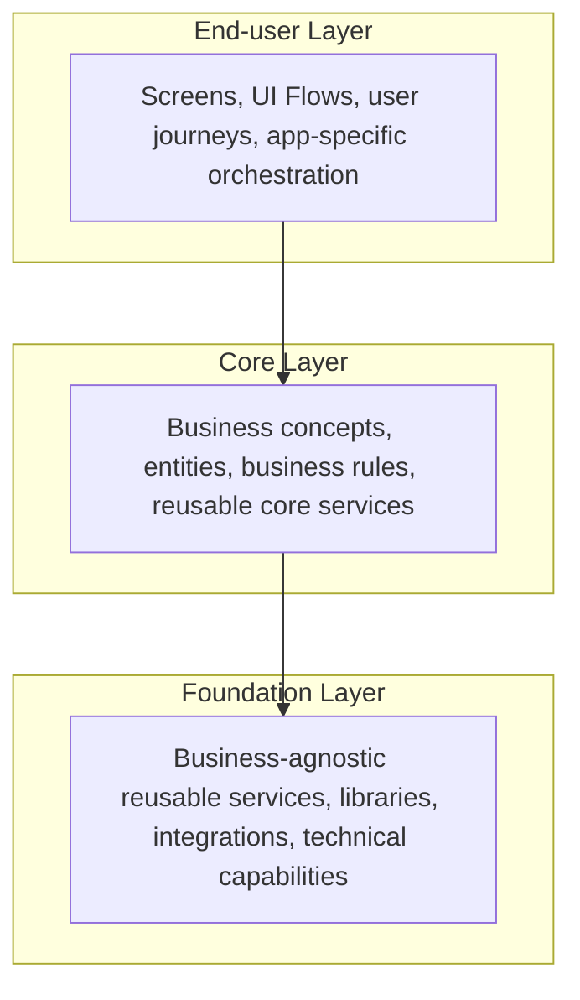
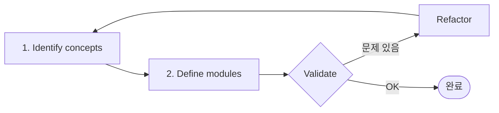

# OutSystems Architecture Specialist (O11)
## Study Notes 통합본
### Architecture Canvas + Using the Architecture Canvas

---

## 1단원. Architecture Canvas - 3 Layer 구조

### 영어 핵심 문장

> The Architecture Canvas organizes modules into layers to promote separation of concerns, reuse, and maintainability.  
> Dependencies should generally point downward: **End-user → Core → Foundation**.  
> Architecture design is an iterative process: identify concepts, define modules, validate, and refactor when needed.

---

### Architecture Canvas 3-Layer 구조

> **Allowed dependency direction: End-user → Core → Foundation**

---

### Layer별 책임 정리

| Layer | 한글 의미 | 주요 책임 | 시험 키워드 |
|---|---|---|---|
| End-user Layer | 사용자 앱/화면 계층 | Screens, UI Flows, 사용자 여정, 화면 중심 orchestration | Screens, user interaction, UX, app-specific flow |
| Core Layer | 업무 핵심 계층 | Business concepts, entities, business rules, reusable Core Services | Customer, Order, Product, business rule, CRUD |
| Foundation Layer | 공통 기반 계층 | 업무와 무관한 재사용 기술 서비스, 라이브러리, 공통 기능 | Logging, authentication helper, email/SMS, integration wrapper, utilities |

---

### End-user Layer

- 사용자가 직접 사용하는 화면과 사용자 흐름을 담당
- 화면, 메뉴, 사용자별 업무 플로우, UI orchestration이 여기에 들어감
- End-user 모듈은 **재사용 서비스를 제공하는 곳이 아니라, Core/Foundation 서비스를 소비하는 곳**

**시험 함정:**
- Screen이 보이면 End-user 후보
- 공통 업무 로직을 End-user에 두고 다른 앱이 재사용하게 만들면 나쁜 구조
- End-user → End-user 참조는 lifecycle 독립성을 깨뜨릴 수 있음

---

### Core Layer

- 업무 개념과 업무 규칙을 담당
- Customer, Order, Product, Invoice 같은 비즈니스 개념, 해당 엔터티, CRUD, 재사용 가능한 비즈니스 액션이 여기에 들어감

**시험 함정:**
- Customer, Order 같은 업무 명사는 Core 후보
- 여러 End-user 앱이 재사용하는 업무 로직은 Core로 내려야 함
- Core가 End-user 화면을 참조하면 잘못된 방향

---

### Foundation Layer

- 특정 업무 개념에 종속되지 않는 공통 기반 기능을 담당
- 로깅, 인증 보조, 공통 유틸리티, 기술 어댑터, 공통 라이브러리 등이 여기에 들어감

**시험 함정:**
- Foundation은 업무를 몰라야 함
- Customer, Order 같은 업무 엔터티를 Foundation에 두면 보통 틀림
- Foundation → Core 참조는 **upward reference**이므로 위험

---

### Dependency 방향

- **정상 방향:** End-user → Core → Foundation
- **위험 방향:** Foundation → Core, Core → End-user, End-user → End-user
- Layer 위반은 cyclic dependency, lifecycle 충돌, 재사용성 저하로 이어질 수 있음

---

## 2단원. Using the Architecture Canvas

### Architecture Iteration

| 번호 | 영어 | 한글 의미 | 역할 |
|---|---|---|---|
| 1 | Identify concepts | 개념 식별 | 업무에서 중요한 독립 개념을 찾는다 |
| 2 | Define modules | 모듈 정의 | 찾은 개념을 OutSystems 모듈로 나눈다 |
| 중앙 | Architecture Iteration | 아키텍처 반복 | 한 번에 끝내지 않고 계속 검토하고 조정한다 |

---

### Identify concepts

concept는 단순 화면 이름이 아니라, 업무적으로 독립적인 의미를 가지는 대상이다:

> Customer / Product / Order / Invoice / Contract / Employee / Payment / Notification

> ⚠️ 시험에서는 화면 기준으로 모듈을 먼저 나누는 답보다, **business concept를 먼저 찾고 그 개념을 모듈로 전환**하는 답이 좋은 경우가 많다.

---

### Define modules

업무 개념을 찾은 뒤에는 그 개념을 어떤 OutSystems 모듈로 나눌지 결정한다:

| 업무 개념/영역 | 가능한 모듈 | 역할 |
|---|---|---|
| Customer | Customer_CS | Customer 업무 개념, 엔터티, 비즈니스 규칙 제공 |
| Customer external integration | Customer_IS | ERP/CRM API 호출, 인증, 매핑, 오류 표준화 |
| Customer management UI | Customer_Backoffice | 고객 관리 화면과 사용자 흐름 |
| Product | Product_CS | Product 업무 개념과 규칙 제공 |

---

### Architecture Iteration

**영어 핵심:**
> Architecture design is an iterative process.

Architecture Canvas는 한 번 작성하고 끝나는 문서가 아니다. 반복 흐름:

> Identify concepts → Define modules → Validate architecture → Refactor if needed → Iterate

---

### Electronic Canvas Tool

Forge에서 제공되는 Electronic Canvas Tool:
- place concepts: 개념 배치
- move concepts: 개념 이동 및 조정
- identify architectural elements: 구현해야 할 아키텍처 요소 식별
- organize architectural elements: 요소 정리

> ⚠️ Electronic Canvas는 **실행 도구가 아니라** 아키텍처 개념을 배치/정리하는 **설계 보조 도구**다.

---

### 시험 함정 포인트

| 함정 | 정답 방향 |
|---|---|
| 화면부터 모듈을 만든다 | 업무 개념을 먼저 식별하고 모듈을 정의한다 |
| Architecture Canvas는 한 번 만들면 끝이다 | 반복적으로 검토하고 개선한다 |
| 모듈만 나누면 설계 완료다 | Validation으로 Layer와 dependency를 확인해야 한다 |
| Electronic Canvas는 실행 도구다 | 아키텍처 개념을 배치/정리하는 설계 보조 도구다 |

---

### 암기 문장

> **Identify concepts first, then define modules, validate the architecture, and iterate.**

---

### 실전 문제

**Q1.** What is the first step when using the Architecture Canvas?
- A. Create screens
- **B. Identify concepts** ✅
- C. Publish the application
- D. Create database indexes

**Q2.** Architecture design using the Architecture Canvas is best described as:
- A. A one-time activity
- **B. An iterative process** ✅
- C. A database migration process
- D. A UI styling activity

**Q3.** Which article helps convert business concepts into application modules?
- A. Validating your application architecture
- **B. Translating business concepts into application modules** ✅
- C. Style Guide Architectures
- D. Taking the exam

**Q4.** Which layer should contain screens and user interaction flows?
- A. Foundation Layer
- B. Core Layer
- **C. End-user Layer** ✅
- D. Database Layer

**Q5.** A module contains Customer entity, Customer CRUD actions, and Customer business rules. Where should it be placed?
- A. End-user Layer
- **B. Core Layer** ✅
- C. Foundation Layer
- D. Style Guide Layer

**Q6.** A logging utility is reused by several applications and has no business-specific logic. Where should it be placed?
- A. End-user Layer
- B. Core Layer
- **C. Foundation Layer** ✅
- D. Any screen module

**Q7.** Which dependency direction is generally correct?
- A. Foundation → Core → End-user
- **B. End-user → Core → Foundation** ✅
- C. Core → End-user → Foundation
- D. Foundation → End-user → Core
