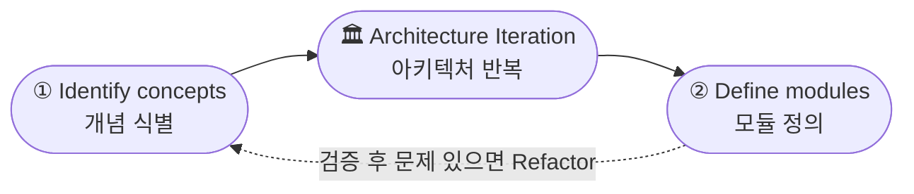
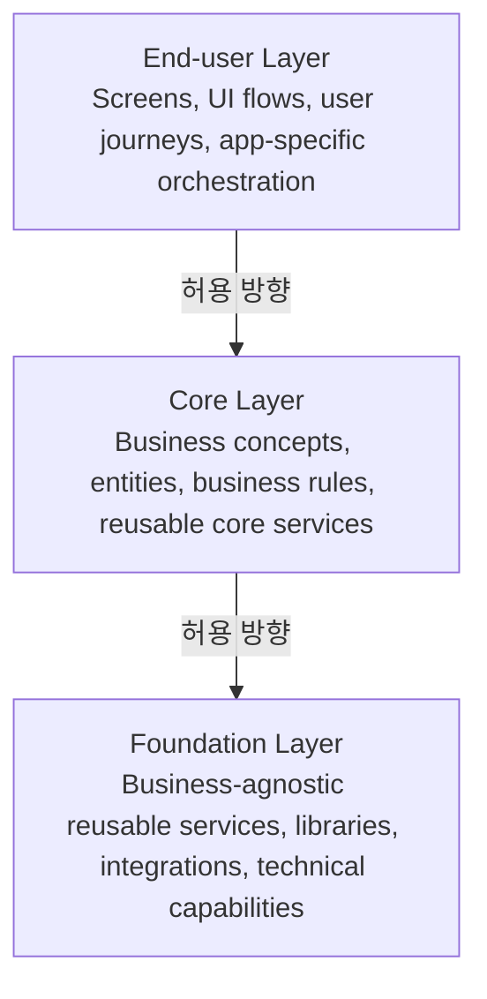

# OutSystems Architecture Specialist (O11)
## Study Notes: Using the Architecture Canvas + 3-Layer Structure
벼락치기 정리노트 통합본 (2단원 + 2단원 보강)

> 🌐 **스타일 버전 (색상/다이어그램 완전 재현):**
> [htmlpreview로 보기](https://htmlpreview.github.io/?https://github.com/kckworld/outsystems_study/blob/main/Architecture%20Specialist%20(O11)/06_Study_Notes_v2.html)

---

## 2단원. Using the Architecture Canvas

이 단원은 Architecture Canvas를 실제로 어떻게 시작하고 반복적으로 사용하는지 설명합니다. 핵심은 업무 개념을 먼저 식별하고, 그 다음 모듈을 정의하고, 검증과 수정을 반복하는 것입니다.

### 그림 먼저 이해하기 - Architecture Iteration

*그림 2-1. Architecture Iteration - Identify concepts → Define modules → 반복*

| 번호 | 영어 | 한글 의미 | 역할 |
|---|---|---|---|
| 1 | Identify concepts | 개념 식별 | 업무에서 중요한 독립 개념을 찾는다. |
| 2 | Define modules | 모듈 정의 | 찾은 개념을 OutSystems 모듈로 나눈다. |
| 중앙 | Architecture Iteration | 아키텍처 반복 | 한 번에 끝내지 않고 계속 검토하고 조정한다. |

---

## 1. 영어 원문과 해석

Using the Architecture Canvas

해석: Architecture Canvas 사용하기

To start using the Architecture Canvas check the following articles:

해석: Architecture Canvas를 사용하기 시작하려면 다음 문서들을 확인하라.

- Translating business concepts into application modules - 업무 개념을 애플리케이션 모듈로 변환하기
- Validating your application architecture - 애플리케이션 아키텍처 검증하기

---

## 2. Identify concepts

영어 핵심: Identify concepts

한글 의미: 업무 개념을 식별한다.

여기서 concept는 단순 화면 이름이 아니라, 업무적으로 독립적인 의미를 가지는 대상입니다.

> Customer / Product / Order / Invoice / Contract / Employee / Payment / Notification

시험에서는 화면 기준으로 모듈을 먼저 나누는 답보다, business concept를 먼저 찾고 그 개념을 모듈로 전환하는 답이 좋은 경우가 많습니다.

---

## 3. Define modules

영어 핵심: Define modules

한글 의미: 모듈을 정의한다.

업무 개념을 찾은 뒤에는 그 개념을 어떤 OutSystems 모듈로 나눌지 결정합니다.

| 업무 개념/영역 | 가능한 모듈 | 역할 |
|---|---|---|
| Customer | Customer_CS | Customer 업무 개념, 엔터티, 비즈니스 규칙 제공 |
| Customer external integration | Customer_IS | ERP/CRM API 호출, 인증, 매핑, 오류 표준화 |
| Customer management UI | Customer_Backoffice | 고객 관리 화면과 사용자 흐름 |
| Product | Product_CS | Product 업무 개념과 규칙 제공 |

---

## 4. Architecture Iteration

영어 핵심: Architecture design is an iterative process.

해석: 아키텍처 설계는 반복적인 과정이다.

Architecture Canvas는 한 번 작성하고 끝나는 문서가 아닙니다. 개념을 식별하고, 모듈을 정의하고, 검증한 뒤, 문제가 있으면 다시 수정하는 반복 설계 방식입니다.

> Identify concepts → Define modules → Validate architecture → Refactor if needed → Iterate

---

## 5. 연결 문서 의미

| 문서명 | 시험상 의미 |
|---|---|
| Translating business concepts into application modules | Identify concepts와 Define modules를 연결한다. 업무 개념을 모듈로 변환하는 기준을 제공한다. |
| Validating your application architecture | 정의한 모듈 구조가 올바른지 검증한다. Layer 위반, dependency 방향, cyclic dependency 등을 확인한다. |

---

## 6. Electronic Canvas Tool

영어 핵심: Electronic Canvas tool

해석: Architecture Canvas를 디지털로 그리는 도구

Forge에서 제공되는 Electronic Canvas Tool은 개념을 디지털 Canvas에 배치하고 이동하면서 새 프로젝트에 필요한 아키텍처 요소를 식별하고 정리하도록 도와줍니다.

- place concepts - 개념 배치
- move concepts - 개념 이동 및 조정
- identify architectural elements - 구현해야 할 아키텍처 요소 식별
- organize architectural elements - 요소 정리

---

## 7. 시험 함정 포인트

| 함정 | 정답 방향 |
|---|---|
| 화면부터 모듈을 만든다 | 업무 개념을 먼저 식별하고 모듈을 정의한다. |
| Architecture Canvas는 한 번 만들면 끝이다 | 반복적으로 검토하고 개선한다. |
| 모듈만 나누면 설계 완료다 | Validation으로 Layer와 dependency를 확인해야 한다. |
| Electronic Canvas는 실행 도구다 | 아키텍처 개념을 배치/정리하는 설계 보조 도구다. |

---

## 8. 원장님 암기 문장

> Identify concepts first, then define modules, validate the architecture, and iterate.

해석: 먼저 개념을 식별하고, 그 다음 모듈을 정의하고, 아키텍처를 검증한 뒤 반복 개선한다.

---

## 9. 실전 문제

**Q1.** What is the first step when using the Architecture Canvas?
> Q1. Architecture Canvas를 사용할 때 첫 번째 단계는 무엇인가?
- A. Create screens / B. Identify concepts / C. Publish the application / D. Create database indexes

정답 보기

✅ **정답: B** — Identify concepts

**Q2.** Architecture design using the Architecture Canvas is best described as:
> Q2. Architecture Canvas를 사용한 아키텍처 설계를 가장 잘 설명하는 것은?
- A. A one-time activity / B. An iterative process / C. A database migration process / D. A UI styling activity

정답 보기

✅ **정답: B** — An iterative process

**Q3.** Which article helps convert business concepts into application modules?
> Q3. 업무 개념을 애플리케이션 모듈로 변환하는 데 도움이 되는 문서는?
- A. Validating your application architecture
- B. Translating business concepts into application modules
- C. Style Guide Architectures
- D. Taking the exam

정답 보기

✅ **정답: B** — Translating business concepts into application modules

---

> **한 줄 결론**
> Architecture Canvas는 업무 개념을 먼저 식별하고, 그 개념을 모듈로 정의한 뒤, 검증과 수정을 반복하는 아키텍처 설계 방식입니다.

*업데이트 기록: 2026-05-14 - 원장님이 올려주신 Architecture Iteration 그림과 Using the Architecture Canvas 설명을 2단원으로 추가했습니다. 그림은 본문 설명 위치에 삽입했습니다.*

---

## 2단원 보강. Architecture Canvas 3-Layer Structure

확인 결과, 이전 문서의 2단원에는 Architecture Iteration 그림과 Using the Architecture Canvas 설명은 들어갔지만, Architecture Canvas의 핵심 레이어인 End-user / Core / Foundation 설명이 부족했습니다. 이 보강 섹션은 그 누락 부분을 시험 대비용으로 추가한 내용입니다.

> **영어 핵심 문장**
> - The Architecture Canvas organizes modules into layers to promote separation of concerns, reuse, and maintainability.
> - Dependencies should generally point downward: End-user → Core → Foundation.
> - Architecture design is an iterative process: identify concepts, define modules, validate, and refactor when needed.

### 그림 2-2. Architecture Canvas 3-Layer 구조

*Allowed dependency direction: End-user → Core → Foundation*

### 레이어별 책임 정리

| Layer | 한글 의미 | 주요 책임 | 시험 키워드 |
|---|---|---|---|
| End-user Layer | 사용자 앱/화면 계층 | Screens, UI Flows, 사용자 여정, 화면 중심 orchestration | Screens, user interaction, UX, app-specific flow |
| Core Layer | 업무 핵심 계층 | Business concepts, entities, business rules, reusable Core Services | Customer, Order, Product, business rule, CRUD |
| Foundation Layer | 공통 기반 계층 | 업무와 무관한 재사용 기술 서비스, 라이브러리, 공통 기능 | Logging, authentication helper, email/SMS, integration wrapper, utilities |

---

### 1. End-user Layer

사용자가 직접 사용하는 화면과 사용자 흐름을 담당합니다. 화면, 메뉴, 사용자별 업무 플로우, UI orchestration이 여기에 들어갑니다. End-user 모듈은 재사용 서비스를 제공하는 곳이 아니라, Core/Foundation 서비스를 소비하는 곳입니다.

English key sentences:
- End-user modules support user interactions, screens, and user journeys.
- End-user modules should not provide reusable services to other modules.

시험 함정:
- Screen이 보이면 End-user 후보입니다.
- 공통 업무 로직을 End-user에 두고 다른 앱이 재사용하게 만들면 나쁜 구조입니다.
- End-user → End-user 참조는 lifecycle 독립성을 깨뜨릴 수 있습니다.

---

### 2. Core Layer

업무 개념과 업무 규칙을 담당합니다. Customer, Order, Product, Invoice 같은 비즈니스 개념, 해당 엔터티, CRUD, 재사용 가능한 비즈니스 액션이 여기에 들어갑니다.

English key sentences:
- Core modules contain business concepts, business entities, and business rules.
- Core Services expose reusable business capabilities to End-user applications.

시험 함정:
- Customer, Order 같은 업무 명사는 Core 후보입니다.
- 여러 End-user 앱이 재사용하는 업무 로직은 Core로 내려야 합니다.
- Core가 End-user 화면을 참조하면 잘못된 방향입니다.

---

### 3. Foundation Layer

특정 업무 개념에 종속되지 않는 공통 기반 기능을 담당합니다. 로깅, 인증 보조, 공통 유틸리티, 기술 어댑터, 공통 라이브러리 등이 여기에 들어갑니다.

English key sentences:
- Foundation modules provide reusable, business-agnostic services.
- Foundation should not depend on Core business concepts.

시험 함정:
- Foundation은 업무를 몰라야 합니다.
- Customer, Order 같은 업무 엔터티를 Foundation에 두면 보통 틀립니다.
- Foundation → Core 참조는 upward reference이므로 위험합니다.

---

### 4. Dependency 방향

- 정상 방향: End-user → Core → Foundation
- 위험 방향: Foundation → Core, Core → End-user, End-user → End-user
- Layer 위반은 cyclic dependency, lifecycle 충돌, 재사용성 저하로 이어질 수 있습니다.

---

### 5. 보강 실전 문제

**Q1.** Which layer should contain screens and user interaction flows?
> Q1. 화면과 사용자 인터랙션 흐름은 어느 레이어에 포함되어야 하는가?
- A. Foundation Layer / B. Core Layer / C. End-user Layer / D. Database Layer

정답 보기

✅ **정답: C** — 화면과 사용자 흐름은 End-user Layer입니다.

**Q2.** A module contains Customer entity, Customer CRUD actions, and Customer business rules. Where should it be placed?
> Q2. Customer 엔터티, Customer CRUD 액션, Customer 업무 규칙을 포함하는 모듈은 어디에 배치해야 하는가?
- A. End-user Layer / B. Core Layer / C. Foundation Layer / D. Style Guide Layer

정답 보기

✅ **정답: B** — Customer는 업무 개념이므로 Core Layer입니다.

**Q3.** A logging utility is reused by several applications and has no business-specific logic. Where should it be placed?
> Q3. 여러 애플리케이션에서 재사용되며 업무 특화 로직이 없는 logging 유틸리티는 어디에 배치해야 하는가?
- A. End-user Layer / B. Core Layer / C. Foundation Layer / D. Any screen module

정답 보기

✅ **정답: C** — 업무와 무관한 공통 기술 기능은 Foundation Layer입니다.

**Q4.** Which dependency direction is generally correct?
> Q4. 일반적으로 올바른 의존성 방향은?
- A. Foundation → Core → End-user
- B. End-user → Core → Foundation
- C. Core → End-user → Foundation
- D. Foundation → End-user → Core

정답 보기

✅ **정답: B** — 일반적으로 참조는 아래 방향으로 흐릅니다.

---

> **보강 후 한 줄 결론**
> Architecture Canvas는 Identify concepts → Define modules 반복만 의미하는 것이 아니라, End-user / Core / Foundation 레이어에 모듈을 올바르게 배치하고 의존성 방향을 검증하는 기준입니다.
